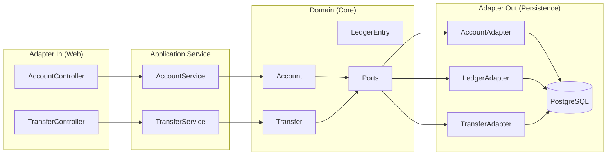
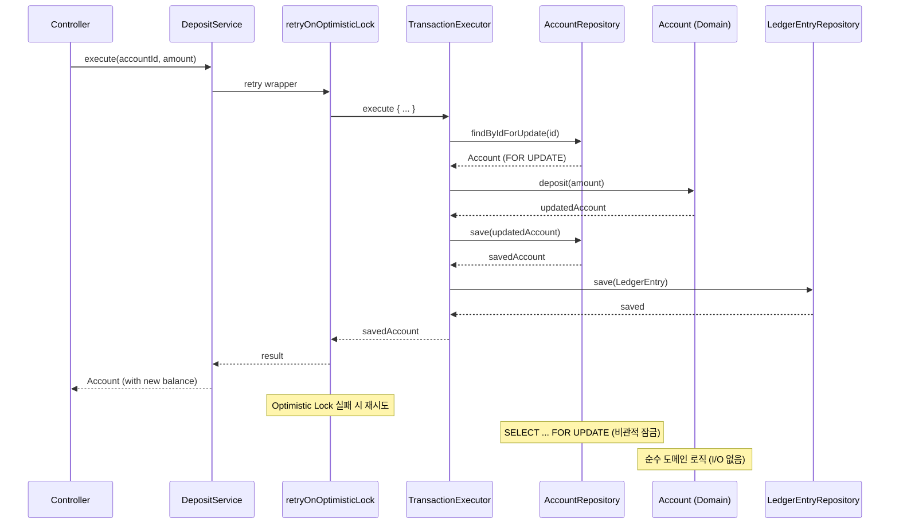
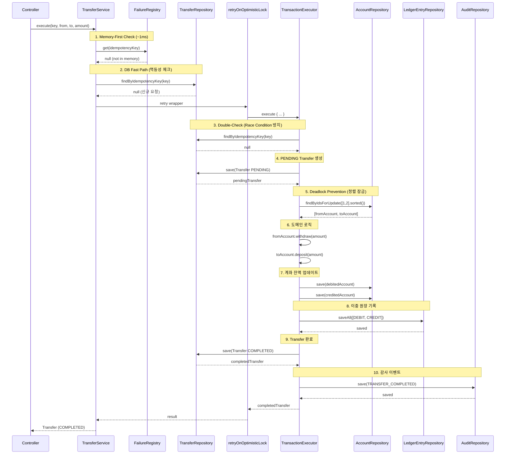
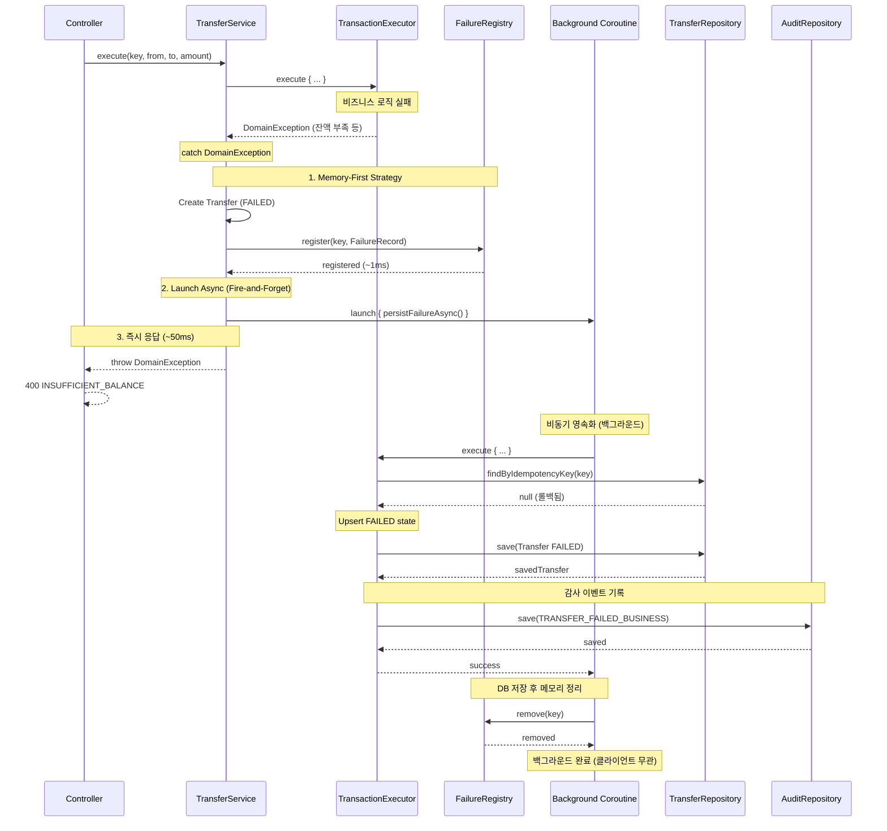

# Account Ledger & Transfer Service

> 실시간 계좌 잔액 관리와 안전한 이체 처리를 제공하는 Reactive 원장 서비스

## 주요 특징

- **Reactive Stack**: Spring WebFlux와 Kotlin Coroutines 기반의 비동기 처리
- **Hexagonal Architecture**: 도메인 중심의 계층형 아키텍처로 비즈니스 로직 분리
- **동시성 제어**: Optimistic Locking과 Deadlock Prevention으로 안전한 동시 처리
- **멱등성 보장**: Idempotency-Key 기반의 중복 이체 방지

## 기술 스택

| 카테고리 | 기술 | 버전 |
|---------|------|------|
| Language | Kotlin | 1.9.25 |
| Framework | Spring Boot | **3.4.13** |
| Reactive | WebFlux + Coroutines | 1.9.0 |
| Persistence | R2DBC + PostgreSQL | 1.0.7 / 16 |
| Build Tool | Gradle | 8.11.1 |
| JDK | OpenJDK | 21 |
| Testing | JUnit 5 + Testcontainers + Spring Test | - |
| Coverage | Kover | 0.9.4 |

## 아키텍처

본 프로젝트는 Hexagonal Architecture(포트-어댑터 패턴)를 따릅니다.



### 계층별 책임

- **Adapter In**: REST API 요청/응답 처리, DTO 변환
- **Application Service**: 유스케이스 조율, 트랜잭션 관리
- **Domain**: 핵심 비즈니스 로직 및 규칙
- **Adapter Out**: 데이터베이스 영속성 처리

## 핵심 흐름 (Sequence Diagrams)

### 1. 입금 흐름 (Deposit)



### 2. 이체 성공 흐름 (Transfer Success)



### 3. 이체 실패 흐름 (Transfer Failure)



## 빠른 시작

### Prerequisites

- JDK 21 이상
- Docker 및 Docker Compose

### 실행

```bash
# PostgreSQL 시작
docker compose up -d postgres

# 애플리케이션 실행
./gradlew bootRun

# 접속
# http://localhost:8080
```

자세한 내용은 [Getting Started Guide](docs/GETTING_STARTED.md)를 참조하세요.

## API 엔드포인트

**8개 엔드포인트 제공**

| Method | Path | Status | 설명 |
|--------|------|--------|------|
| GET | `/api/accounts` | 200 | 계좌 목록 조회 (페이지네이션) |
| POST | `/api/accounts` | 201 | 계좌 생성 |
| GET | `/api/accounts/{id}` | 200 | 계좌 조회 |
| POST | `/api/accounts/{id}/deposits` | 200 | 입금 |
| GET | `/api/accounts/{id}/ledger-entries` | 200 | 원장 내역 조회 (페이지네이션) |
| PATCH | `/api/accounts/{id}/status` | 200 | 계좌 상태 변경 |
| GET | `/api/transfers` | 200 | 이체 목록 조회 (페이지네이션) |
| POST | `/api/transfers` | 201 | 이체 |

**API 문서**:
- Swagger UI: http://localhost:8080/swagger-ui.html
- 상세 API 명세: [API_REFERENCE.md](docs/API_REFERENCE.md)
- curl 호출 시나리오: [API_CURL_SCENARIO.md](docs/API_CURL_SCENARIO.md)

### Swagger 사용 시나리오 (dev 프로필)

Swagger UI에서 실제 API를 호출해보는 가장 빠른 흐름입니다.

1. 애플리케이션 실행 후 Swagger UI 접속
```bash
docker compose up -d postgres
./gradlew bootRun
```
- 접속: `http://localhost:8080/swagger-ui.html`

2. 개발용 JWT 토큰 발급 (`POST /api/dev/tokens`)
- `Try it out` 클릭 후 아래 Body로 `Execute`
```json
{
  "userId": "user123",
  "username": "testuser"
}
```
- 응답의 `token` 값을 복사

3. Swagger `Authorize` 설정
- 우측 상단 `Authorize` 클릭
- 값 입력: `Bearer <token>`
- `Authorize` -> `Close`

4. 인증 필요한 조회 API 호출
- 예: `GET /api/accounts`
- 정상일 때 `200 OK` 확인

5. 쓰기 API 호출 시나리오
- `POST /api/accounts`로 계좌 2개 생성
- `POST /api/accounts/{id}/deposits`로 송금 계좌에 금액 입금
- `POST /api/transfers` 호출 시 Header에 `Idempotency-Key`를 반드시 추가
- `Idempotency-Key` 예시: UUID (`550e8400-e29b-41d4-a716-446655440000`)

6. 결과 검증
- `GET /api/transfers`로 이체 내역 확인
- `GET /api/accounts/{id}/ledger-entries`로 원장 기록 확인

7. 자주 보는 응답 코드
- `401 UNAUTHORIZED`: 토큰 누락/만료/형식 오류
- `400 VALIDATION_FAILED`: 요청 본문/파라미터 검증 실패
- `409 DUPLICATE_TRANSFER`: 동일 `Idempotency-Key` 재사용

참고: `prod` 프로필에서는 Swagger/OpenAPI 및 dev 토큰 발급 엔드포인트가 비활성화됩니다.

### curl 호출 시나리오 (dev 프로필)

Swagger 없이 터미널에서 동일한 흐름을 검증하려면 아래 문서를 참고하세요.

- [curl API 호출 시나리오 (dev)](docs/API_CURL_SCENARIO.md)

## 인증 (Authentication)

모든 `/api/**` 엔드포인트는 JWT 토큰 인증이 필요합니다.

### 개발용 토큰 발급 (dev 프로필)

```bash
# 토큰 발급
TOKEN=$(curl -s -X POST http://localhost:8080/api/dev/tokens \
  -H "Content-Type: application/json" \
  -d '{"userId": "user123", "username": "testuser"}' \
  | jq -r '.token')

# API 호출
curl http://localhost:8080/api/accounts/1 \
  -H "Authorization: Bearer $TOKEN"
```

자세한 내용은 [Authentication Guide](docs/AUTHENTICATION_GUIDE.md)를 참조하세요.

## 핵심 설계 패턴

### 1. Optimistic Locking

`@Version` 컬럼을 활용한 낙관적 잠금으로 동시성 제어:
- 동시 수정 시 `OptimisticLockException` 발생 (409)
- 클라이언트는 최신 데이터로 재시도

### 2. Idempotency (멱등성)

이체 API는 3-Tier 멱등성 보장:
1. **Memory Check**: FailureRegistry (가장 빠름)
2. **DB Fast Path**: 트랜잭션 밖 조회 (성능 최적화)
3. **DB Double-Check**: 트랜잭션 내 재확인 (Race Condition 방지)

### 3. Deadlock Prevention

계좌 ID 정렬로 교착상태 원천 차단:
- 모든 트랜잭션이 동일한 순서로 잠금 획득
- `SELECT ... FOR UPDATE` 순서 보장

### 4. Memory-First Async Persistence

이체 실패 시:
1. 메모리에 즉시 등록 (~1ms)
2. 비동기 DB 영속화 (Fire-and-Forget)
3. 클라이언트 빠른 응답 (~50ms)

> 각 패턴의 도입 배경과 의사결정 근거는 [Design Decisions](docs/DESIGN_DECISIONS.md)를 참조하세요.

## 테스트

### 실행

```bash
# 전체 테스트
./gradlew test

# 커버리지 리포트
./gradlew koverHtmlReport
# → build/reports/kover/html/index.html

# 커버리지 검증 (최소 70%)
./gradlew koverVerify
```

### 커버리지

- **현재**: 93.53%
- **최소 요구사항**: 70%
- **총 테스트 파일**: 33개

## 운영 가이드

본 서비스는 프로덕션 환경에서 다음을 지원합니다:

- **R2DBC Connection Pool**: 환경별 최적화된 풀 설정
- **Timeout Configuration**: 모든 레이어의 타임아웃 설정
- **Graceful Shutdown**: 진행 중인 요청 안전 완료
- **Actuator & Health Check**: Kubernetes Probes 지원

자세한 내용은 [Operations Guide](docs/OPERATIONS_GUIDE.md)를 참조하세요.

## 개발 이력

본 프로젝트는 Issue-Driven Development 방식으로 개발되었습니다.

### Completed Phases

- ✅ **Phase 1**: 프로젝트 기반 설정 (Hexagonal Architecture, R2DBC, Testcontainers)
- ✅ **Phase 2**: 도메인 모델 (Account, Transfer, LedgerEntry)
- ✅ **Phase 3**: 영속성 레이어 (Adapter Pattern, Repository)
- ✅ **Phase 4**: 애플리케이션 서비스 (Use Cases, Transaction Management)
- ✅ **Phase 5**: Web API (REST Controllers, DTO, Exception Handler)
- ✅ **Phase 6**: 품질 개선 (Kover, Integration Tests, README)
- ✅ **Phase 7**: 보안 강화 (JWT 인증, Spring Security, Idempotency)
- ✅ **Phase 8**: 아키텍처 검증 (ArchUnit, Architecture Tests, Documentation)
- ✅ **Phase 9**: 안정성 강화 (Retry Logic, DLQ, In-Memory Cache)

**전체 이슈**: [GitHub Issues](https://github.com/seokrae-labs/account-ledger-service/issues)
**최근 PR**: [Pull Requests](https://github.com/seokrae-labs/account-ledger-service/pulls)

## 문서

### 📚 사용자 가이드
- **[Getting Started](docs/GETTING_STARTED.md)**: 환경 설정, Docker 실행, 프로젝트 구조
- **[API Reference](docs/API_REFERENCE.md)**: REST API 상세 명세, 에러 코드
- **[Authentication Guide](docs/AUTHENTICATION_GUIDE.md)**: JWT 인증, 토큰 발급
- **[Operations Guide](docs/OPERATIONS_GUIDE.md)**: 운영 환경 설정, 모니터링

### 🏗️ 아키텍처 가이드
- **[설계 결정 기록 (Design Decisions)](docs/DESIGN_DECISIONS.md)**: 각 패턴의 도입 배경, 필요성, 대안 분석
- **[Suspend 함수 분석 & Best Practice](docs/SUSPEND_BEST_PRACTICES.md)**: 레이어별 Suspend 심층 분석, 트랜잭션 관리, Flow 처리
- **[Java 개발자를 위한 Suspend 가이드](docs/SUSPEND_FOR_JAVA_DEVELOPERS.md)**: Blocking I/O, CompletableFuture, Reactor와 비교 (Virtual Threads 포함)

### 🔬 POC 및 연구
- **[Suspend 함수 검증 POC 결과](docs/POC_SUSPEND_VALIDATION_RESULT.md)**: ArchUnit 기반 Continuation 파라미터 감지 검증 (100% 정확도)

## 라이선스

이 프로젝트는 학습 및 포트폴리오 목적으로 작성되었습니다.

---

**마지막 업데이트**: 2026-02-17
**Spring Boot**: 3.4.13
**커버리지**: 93.53%
**테스트**: 33개
**상태**: ✅ 전체 개발 완료
