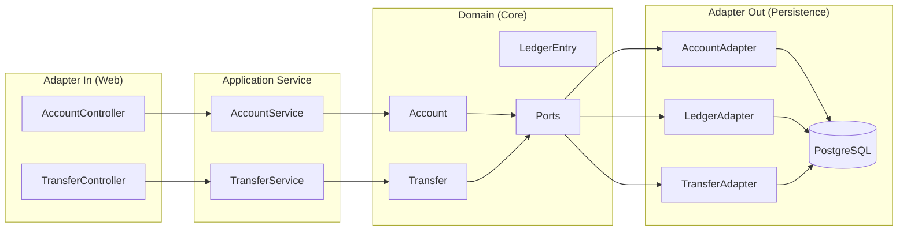

# Account Ledger & Transfer Service

> 실시간 계좌 잔액 관리와 안전한 이체 처리를 제공하는 Reactive 원장 서비스

## 주요 특징

- **Reactive Stack**: Spring WebFlux와 Kotlin Coroutines 기반의 비동기 처리
- **Hexagonal Architecture**: 도메인 중심의 계층형 아키텍처로 비즈니스 로직 분리
- **동시성 제어**: Optimistic Locking과 Deadlock Prevention으로 안전한 동시 처리
- **멱등성 보장**: Idempotency-Key 기반의 중복 이체 방지

## 기술 스택

| 카테고리 | 기술 | 버전 |
|---------|------|------|
| Language | Kotlin | 1.9.25 |
| Framework | Spring Boot | 3.4.2 |
| Reactive | WebFlux + Coroutines | 1.9.0 |
| Persistence | R2DBC + PostgreSQL | 1.0.7 / 16 |
| Build Tool | Gradle | 8.11.1 |
| JDK | OpenJDK | 21 |
| Testing | JUnit 5 + Testcontainers | 1.20.4 |
| Coverage | Kover | 0.9.4 |

## 아키텍처

본 프로젝트는 Hexagonal Architecture(포트-어댑터 패턴)를 따릅니다.



### 계층별 책임

- **Adapter In**: REST API 요청/응답 처리, DTO 변환
- **Application Service**: 유스케이스 조율, 트랜잭션 관리
- **Domain**: 핵심 비즈니스 로직 및 규칙
- **Adapter Out**: 데이터베이스 영속성 처리

## 시작하기

### Prerequisites

- **JDK 21** 이상
- **Docker** 및 **Docker Compose**

### 환경 설정

1. PostgreSQL 실행
```bash
docker-compose up -d
```

2. 애플리케이션 실행
```bash
./gradlew bootRun
```

3. 접속
```
http://localhost:8080
```

## API 엔드포인트

### 엔드포인트 요약

| Method | Path | Status | 설명 |
|--------|------|--------|------|
| POST | `/api/accounts` | 201 | 계좌 생성 |
| GET | `/api/accounts/{id}` | 200 | 계좌 조회 |
| POST | `/api/accounts/{id}/deposits` | 200 | 입금 |
| POST | `/api/transfers` | 201 | 이체 |

### 1. 계좌 생성

**Request**
```bash
curl -X POST http://localhost:8080/api/accounts \
  -H "Content-Type: application/json" \
  -d '{
    "ownerName": "John Doe"
  }'
```

**Response (201 Created)**
```json
{
  "id": 1,
  "ownerName": "John Doe",
  "balance": 0.00,
  "status": "ACTIVE",
  "version": 0,
  "createdAt": "2026-02-09T10:00:00",
  "updatedAt": "2026-02-09T10:00:00"
}
```

### 2. 계좌 조회

**Request**
```bash
curl http://localhost:8080/api/accounts/1
```

**Response (200 OK)**
```json
{
  "id": 1,
  "ownerName": "John Doe",
  "balance": 1000.00,
  "status": "ACTIVE",
  "version": 2,
  "createdAt": "2026-02-09T10:00:00",
  "updatedAt": "2026-02-09T10:05:00"
}
```

### 3. 입금

**Request**
```bash
curl -X POST http://localhost:8080/api/accounts/1/deposits \
  -H "Content-Type: application/json" \
  -d '{
    "amount": 1000.00,
    "description": "Initial deposit"
  }'
```

**Response (200 OK)**
```json
{
  "id": 1,
  "ownerName": "John Doe",
  "balance": 1000.00,
  "status": "ACTIVE",
  "version": 1,
  "createdAt": "2026-02-09T10:00:00",
  "updatedAt": "2026-02-09T10:01:00"
}
```

### 4. 이체

**Request (Idempotency-Key 필수)**
```bash
curl -X POST http://localhost:8080/api/transfers \
  -H "Content-Type: application/json" \
  -H "Idempotency-Key: $(uuidgen)" \
  -d '{
    "fromAccountId": 1,
    "toAccountId": 2,
    "amount": 500.00,
    "description": "Payment for service"
  }'
```

**Response (201 Created)**
```json
{
  "id": 1,
  "idempotencyKey": "550e8400-e29b-41d4-a716-446655440000",
  "fromAccountId": 1,
  "toAccountId": 2,
  "amount": 500.00,
  "status": "COMPLETED",
  "description": "Payment for service",
  "createdAt": "2026-02-09T10:10:00",
  "updatedAt": "2026-02-09T10:10:00"
}
```

### 에러 응답

**Error Response Structure**
```json
{
  "error": "ERROR_CODE",
  "message": "Human-readable error message",
  "timestamp": "2026-02-09T10:00:00"
}
```

**Error Codes**

| HTTP Status | Error Code | 설명 |
|-------------|-----------|------|
| 400 | `INSUFFICIENT_BALANCE` | 잔액 부족 |
| 400 | `INVALID_ACCOUNT_STATUS` | 계좌 상태 오류 (폐쇄된 계좌 등) |
| 400 | `INVALID_AMOUNT` | 유효하지 않은 금액 (음수, 0 등) |
| 400 | `INVALID_REQUEST` | 잘못된 요청 파라미터 |
| 404 | `ACCOUNT_NOT_FOUND` | 계좌를 찾을 수 없음 |
| 409 | `DUPLICATE_TRANSFER` | 중복 이체 요청 (동일한 Idempotency-Key) |
| 409 | `OPTIMISTIC_LOCK_FAILED` | 동시 수정 감지 (재시도 필요) |
| 500 | `INTERNAL_ERROR` | 내부 서버 오류 |

## 핵심 설계 패턴

### 1. Optimistic Locking

데이터베이스의 `@Version` 컬럼을 활용한 낙관적 잠금으로 동시성을 제어합니다.

```kotlin
// Account 엔티티
@Version
val version: Long = 0
```

- 계좌 수정 시 버전 체크
- 버전 불일치 시 `OptimisticLockException` 발생 (409 Conflict)
- 클라이언트는 최신 데이터를 다시 조회하여 재시도

### 2. Idempotency (멱등성)

이체 API는 `Idempotency-Key` 헤더를 통해 중복 처리를 방지합니다.

**Two-Phase Check**

1. **Fast Path**: 트랜잭션 밖에서 완료된 이체 조회 (성능 최적화)
2. **Double-Check**: 트랜잭션 내에서 재확인 (Race Condition 방지)

```kotlin
// Fast path: 트랜잭션 밖
val existing = transferRepository.findByIdempotencyKey(idempotencyKey)
if (existing != null && existing.status == COMPLETED) {
    return existing // 멱등 응답
}

// Double-check: 트랜잭션 내
@Transactional
suspend fun executeTransfer(...) {
    val recheck = transferRepository.findByIdempotencyKey(idempotencyKey)
    if (recheck != null) throw DuplicateTransferException()
    // 이체 처리
}
```

### 3. Deadlock Prevention

이체 시 두 계좌를 동시에 잠그는 과정에서 발생할 수 있는 교착 상태를 방지합니다.

**정렬 기반 잠금 순서 보장**

```kotlin
// 항상 작은 ID → 큰 ID 순서로 잠금
val (firstId, secondId) = if (fromAccountId < toAccountId) {
    fromAccountId to toAccountId
} else {
    toAccountId to fromAccountId
}

val first = accountRepository.findByIdForUpdate(firstId)
val second = accountRepository.findByIdForUpdate(secondId)
```

- 모든 트랜잭션이 동일한 순서로 잠금 획득
- 순환 대기 상태 원천 차단

## 테스트

### 실행

```bash
# 전체 테스트 실행
./gradlew test

# 커버리지 리포트 생성 (HTML)
./gradlew koverHtmlReport
# → build/reports/kover/html/index.html

# 커버리지 검증 (최소 70%)
./gradlew koverVerify
```

### 커버리지

- **현재 커버리지**: 93.53%
- **최소 요구사항**: 70%
- **제외 대상**: Configuration 클래스, DTO, Entity

### 테스트 구성

| 계층 | 파일 수 | 설명 |
|-----|--------|------|
| Domain | 3 | Account, LedgerEntry, Transfer 단위 테스트 |
| Service | 4 | AccountService, TransferService 통합 테스트 |
| Controller | 2 | AccountController, TransferController API 테스트 |

## 프로젝트 구조

```
account-ledger-service/
├── src/
│   ├── main/
│   │   ├── kotlin/com/labs/ledger/
│   │   │   ├── adapter/
│   │   │   │   ├── in/web/
│   │   │   │   │   ├── AccountController.kt
│   │   │   │   │   ├── TransferController.kt
│   │   │   │   │   ├── GlobalExceptionHandler.kt
│   │   │   │   │   └── dto/
│   │   │   │   │       ├── AccountDto.kt
│   │   │   │   │       ├── TransferDto.kt
│   │   │   │   │       └── ErrorResponse.kt
│   │   │   │   └── out/persistence/
│   │   │   │       ├── AccountPersistenceAdapter.kt
│   │   │   │       ├── LedgerPersistenceAdapter.kt
│   │   │   │       ├── TransferPersistenceAdapter.kt
│   │   │   │       ├── entity/
│   │   │   │       │   ├── AccountEntity.kt
│   │   │   │       │   ├── LedgerEntryEntity.kt
│   │   │   │       │   └── TransferEntity.kt
│   │   │   │       └── repository/
│   │   │   │           ├── R2dbcAccountRepository.kt
│   │   │   │           ├── R2dbcLedgerRepository.kt
│   │   │   │           └── R2dbcTransferRepository.kt
│   │   │   ├── application/
│   │   │   │   ├── service/
│   │   │   │   │   ├── AccountService.kt
│   │   │   │   │   └── TransferService.kt
│   │   │   │   └── port/
│   │   │   │       ├── in/
│   │   │   │       │   ├── CreateAccountUseCase.kt
│   │   │   │       │   ├── GetAccountUseCase.kt
│   │   │   │       │   ├── DepositUseCase.kt
│   │   │   │       │   └── TransferUseCase.kt
│   │   │   │       └── out/
│   │   │   │           ├── LoadAccountPort.kt
│   │   │   │           ├── SaveAccountPort.kt
│   │   │   │           ├── LoadLedgerPort.kt
│   │   │   │           ├── SaveLedgerPort.kt
│   │   │   │           ├── LoadTransferPort.kt
│   │   │   │           └── SaveTransferPort.kt
│   │   │   ├── domain/
│   │   │   │   ├── model/
│   │   │   │   │   ├── Account.kt
│   │   │   │   │   ├── LedgerEntry.kt
│   │   │   │   │   └── Transfer.kt
│   │   │   │   └── exception/
│   │   │   │       ├── AccountNotFoundException.kt
│   │   │   │       ├── InsufficientBalanceException.kt
│   │   │   │       ├── InvalidAccountStatusException.kt
│   │   │   │       ├── InvalidAmountException.kt
│   │   │   │       ├── DuplicateTransferException.kt
│   │   │   │       └── OptimisticLockException.kt
│   │   │   ├── infrastructure/
│   │   │   │   └── config/
│   │   │   │       └── R2dbcConfiguration.kt
│   │   │   └── AccountLedgerServiceApplication.kt
│   │   └── resources/
│   │       ├── application.yml
│   │       └── schema.sql
│   └── test/
│       └── kotlin/com/labs/ledger/
│           ├── domain/model/
│           │   ├── AccountTest.kt
│           │   ├── LedgerEntryTest.kt
│           │   └── TransferTest.kt
│           ├── application/service/
│           │   ├── AccountServiceTest.kt
│           │   ├── TransferServiceTest.kt
│           │   ├── DepositConcurrencyTest.kt
│           │   └── TransferConcurrencyTest.kt
│           └── adapter/in/web/
│               ├── AccountControllerTest.kt
│               └── TransferControllerTest.kt
├── build.gradle.kts
├── docker-compose.yml
└── README.md
```

## 개발 이력

본 프로젝트는 Issue-Driven Development 방식으로 개발되었습니다.

### Completed Phases

- ✅ **Phase 1**: 프로젝트 기반 설정 (#1)
- ✅ **Phase 2**: 도메인 모델 (#2~#4)
- ✅ **Phase 3**: 영속성 레이어 (#5~#7)
- ✅ **Phase 4**: 애플리케이션 서비스 (#8~#10)
- ✅ **Phase 5**: Web API (#11~#13)
- ✅ **Phase 6**: 품질 개선 (#14~#16)

**전체 이슈**: [GitHub Issues](https://github.com/seokrae-labs/account-ledger-service/issues)

## 라이선스

이 프로젝트는 학습 및 포트폴리오 목적으로 작성되었습니다.

---

**마지막 업데이트**: 2026-02-09
**커버리지**: 93.53%
**상태**: ✅ 전체 개발 완료
