# 설계 결정 기록 (Design Decisions)

> 왜 이 패턴들이 필요한가 — 각 설계 선택의 동기와 배경

## 개요

본 문서는 Account Ledger Service의 핵심 설계 패턴이 **왜 필요한지**, 각 패턴이 **어떤 문제를 해결하는지**, 그리고 **없으면 어떤 일이 발생하는지**를 설명합니다.

### 패턴 분류 요약

| 패턴 | 분류 | 영향 |
|------|------|------|
| Optimistic Locking | ✅ 필수 | 데이터 무결성 |
| Deadlock Prevention (ID 정렬) | ✅ 필수 | 시스템 가용성 |
| Idempotency Tier 3 (DB Double-Check) | ✅ 필수 | 이중 출금 방지 |
| Idempotency Tier 1-2 (Memory/Fast Path) | 🔶 최적화 | 성능 개선 |
| FOR UPDATE + OL 이중 방어 | ✅ 실질적 필수 | 안정성 + 성능 |
| Memory-First Async Persistence | 🔶 최적화 | 응답 지연 개선 |
| DLQ (Dead Letter Queue) | 🛠️ 운영/감사 | 규정 준수 |

---

## 1. Optimistic Locking (@Version)

### 해결하는 문제

**Lost Update (갱신 손실)**: 두 트랜잭션이 동시에 같은 계좌에 입금할 때, 나중 트랜잭션이 먼저 트랜잭션의 잔액 변경을 덮어쓰는 문제.

#### 문제 시나리오
```
초기 잔액: 1000원

[TX1] 읽기: 1000원
[TX2] 읽기: 1000원
[TX1] 쓰기: 1000 + 500 = 1500원 ✓
[TX2] 쓰기: 1000 + 300 = 1300원 ✓

결과: 1300원 (올바른 값: 1800원)
→ TX1의 +500원이 유실됨! 💸
```

### 해결 방법

`@Version` 컬럼을 통한 낙관적 잠금:

```kotlin
data class Account(
    val id: Long,
    val balance: BigDecimal,
    val version: Long  // ← 매 수정마다 증가
)
```

#### 동작
```
초기: balance=1000, version=0

[TX1] 읽기: balance=1000, version=0
[TX2] 읽기: balance=1000, version=0
[TX1] UPDATE ... SET balance=1500, version=1 WHERE id=1 AND version=0 ✓
[TX2] UPDATE ... SET balance=1300, version=1 WHERE id=1 AND version=0 ✗
      → version=1로 이미 변경됨 → OptimisticLockException (409)

TX2는 최신 데이터로 재조회 후 재시도:
[TX2'] 읽기: balance=1500, version=1
[TX2'] UPDATE ... SET balance=1800, version=2 WHERE id=1 AND version=1 ✓
```

#### 시퀀스 다이어그램

```mermaid
sequenceDiagram
    participant TX1
    participant Account
    participant TX2

    Note over Account: 초기: balance=1000, version=0

    TX1->>Account: READ (balance=1000, version=0)
    TX2->>Account: READ (balance=1000, version=0)

    TX1->>Account: UPDATE balance=1500, version=1<br/>WHERE version=0 ✓
    Note over Account: balance=1500, version=1

    TX2->>Account: UPDATE balance=1300, version=1<br/>WHERE version=0 ✗
    Note over TX2: OptimisticLockException (409)<br/>version이 이미 변경됨

    TX2->>Account: RE-READ (balance=1500, version=1)
    TX2->>Account: UPDATE balance=1800, version=2<br/>WHERE version=1 ✓
    Note over Account: balance=1800, version=2 ✓
```



### 없으면?

- ❌ **잔액 데이터 오류** (Silent Corruption): 사용자에게 알리지 않고 잔액이 틀어짐
- ❌ **감사 추적 불가능**: 원장 기록과 실제 잔액 불일치
- ❌ **금융 규정 위반**: 데이터 무결성 보장 실패

### 분류
✅ **필수** — 금융 시스템의 기본 요구사항

### 참조
- 구현: `src/main/kotlin/.../domain/model/Account.kt`
- 테스트: `src/test/kotlin/.../service/DepositServiceTest.kt` ("동시 입금 시 Optimistic Lock 검증")

---

## 2. Deadlock Prevention (계좌 ID 정렬)

### 해결하는 문제

**교착상태 (Deadlock)**: 두 트랜잭션이 서로 다른 순서로 계좌를 잠그면서 무한 대기 상태에 빠지는 문제.

#### 문제 시나리오
```
계좌 A: ID=1
계좌 B: ID=2

[TX1] A → B 이체
  1. SELECT * FROM accounts WHERE id=1 FOR UPDATE (A 잠금)
  2. SELECT * FROM accounts WHERE id=2 FOR UPDATE (대기...)

[TX2] B → A 이체 (동시 발생)
  1. SELECT * FROM accounts WHERE id=2 FOR UPDATE (B 잠금)
  2. SELECT * FROM accounts WHERE id=1 FOR UPDATE (대기...)

→ TX1은 B 잠금 대기, TX2는 A 잠금 대기
→ PostgreSQL이 Deadlock 감지 → 한 TX 강제 중단 (500 에러)
```

### 해결 방법

**잠금 순서 표준화**: 항상 작은 ID부터 잠금

```kotlin
fun execute(fromId: Long, toId: Long, amount: BigDecimal) {
    val sortedIds = listOf(fromId, toId).sorted()  // ← 핵심!
    val accounts = accountRepository.findByIdsForUpdate(sortedIds)
    // ...
}
```

#### 동작
```
[TX1] A(1) → B(2) 이체
  잠금 순서: 1 → 2

[TX2] B(2) → A(1) 이체
  잠금 순서: 1 → 2 (동일!)

→ TX2는 TX1이 1번 계좌 잠금을 해제할 때까지 대기
→ TX1 완료 후 TX2 순차 실행 (Deadlock 없음)
```

#### 비교 다이어그램

**❌ 정렬 없음 - Deadlock 발생**

```mermaid
sequenceDiagram
    participant TX1 as TX1<br/>(A→B 이체)
    participant AccA as Account A
    participant AccB as Account B
    participant TX2 as TX2<br/>(B→A 이체)

    Note over TX1,TX2: ❌ 정렬 없음 (순서 다름)

    TX1->>AccA: LOCK A ✓
    TX2->>AccB: LOCK B ✓
    TX1->>AccB: LOCK B... (대기 중)
    TX2->>AccA: LOCK A... (대기 중)

    Note over TX1,TX2: 💀 Deadlock!<br/>PostgreSQL이 감지 후 TX 중단
```



**✅ ID 정렬 - Deadlock 방지**

```mermaid
sequenceDiagram
    participant TX1 as TX1<br/>(A→B 이체)
    participant Acc1 as Account 1
    participant Acc2 as Account 2
    participant TX2 as TX2<br/>(B→A 이체)

    Note over TX1,TX2: ✅ ID 정렬 (1→2 순서 통일)

    TX1->>Acc1: LOCK 1 ✓
    TX1->>Acc2: LOCK 2 ✓
    Note over TX1: 이체 처리 완료

    TX2->>Acc1: LOCK 1... (TX1 완료 대기)
    TX1-->>Acc1: UNLOCK 1, 2
    TX2->>Acc1: LOCK 1 ✓
    TX2->>Acc2: LOCK 2 ✓
    Note over TX2: 이체 처리 완료
```



### 없으면?

- ❌ **500 Internal Server Error**: PostgreSQL Deadlock 감지 후 트랜잭션 중단
- ❌ **처리량 저하**: 재시도로 인한 CPU/DB 리소스 낭비
- ❌ **사용자 경험 저하**: 동일 요청이 간헐적으로 실패

### 분류
✅ **필수** — 시스템 가용성의 기본 요구사항

### 참조
- 구현: `src/main/kotlin/.../service/TransferService.kt:89`
- 테스트: `src/test/kotlin/.../service/TransferServiceTest.kt` ("동시 이체 시 deadlock 방지")

---

## 3. Idempotency (멱등성)

### 해결하는 문제

**이중 처리 (Duplicate Processing)**: 네트워크 타임아웃으로 클라이언트가 동일 요청을 재시도할 때, 동일 이체가 2번 실행되는 문제.

#### 문제 시나리오
```
사용자: 1000원 이체 요청 (Idempotency-Key: abc-123)
서버: 이체 처리 완료
네트워크: 응답 패킷 손실 ❌
클라이언트: 타임아웃 → 재시도 (동일 키)

멱등성 없으면:
  → 서버가 다시 1000원 이체
  → 총 2000원 출금! 💸
```

### 해결 방법: 3-Tier 멱등성

#### Tier 1: Memory Check (FailureRegistry)
```kotlin
val existing = failureRegistry.get(idempotencyKey)
if (existing != null) return existing  // ~1ms
```
- **목적**: 최근 실패한 요청의 빠른 재시도 대응
- **성능**: 메모리 조회 (~1ms)

#### Tier 2: DB Fast Path (트랜잭션 밖)
```kotlin
val existing = transferRepository.findByIdempotencyKey(key)
if (existing != null) return existing  // ~10ms
```
- **목적**: 트랜잭션 비용 없이 중복 확인
- **성능**: DB 조회 1회 (~10ms)

#### Tier 3: DB Double-Check (트랜잭션 안)
```kotlin
transactionExecutor.execute {
    val recheck = transferRepository.findByIdempotencyKey(key)
    if (recheck != null) throw DuplicateTransferException()
    // 이체 처리...
}
```
- **목적**: Race Condition 완전 차단
- **필수 이유**: Tier 2 조회 후 트랜잭션 시작 전 다른 TX가 끼어들 수 있음

#### Race Condition 예시 (Tier 3 없을 때)
```
[TX1] Tier 2: 없음 확인
[TX2] Tier 2: 없음 확인 (거의 동시)
[TX1] 트랜잭션 시작 → 이체 처리 ✓
[TX2] 트랜잭션 시작 → 이체 처리 ✓
→ 이중 출금 발생! 💸
```

#### 3-Tier 플로우차트

```mermaid
flowchart TD
    A[이체 요청<br/>Idempotency-Key: abc-123] --> B{Tier 1: Memory<br/>FailureRegistry}
    B -->|HIT<br/>~1ms| Z[이전 결과 반환]
    B -->|MISS| C{Tier 2: DB Fast Path<br/>트랜잭션 밖}
    C -->|HIT<br/>~10ms| Z
    C -->|MISS| D[트랜잭션 시작]

    D --> E{Tier 3: Double-Check<br/>트랜잭션 안}
    E -->|중복 발견| F[DuplicateException]
    E -->|신규 요청| G[이체 처리]

    G --> H[COMPLETED 저장]
    H --> Z

    F --> Z

    style B fill:#e1f5ff,stroke:#0066cc,stroke-width:2px
    style C fill:#e1f5ff,stroke:#0066cc,stroke-width:2px
    style E fill:#fff3cd,stroke:#ff9900,stroke-width:3px
    style G fill:#d4edda,stroke:#28a745,stroke-width:2px
    style Z fill:#f8f9fa,stroke:#6c757d,stroke-width:2px

    classDef critical fill:#fff3cd,stroke:#ff9900,stroke-width:3px
    class E critical
```



**범례**:
- 🔵 **파란색 (Tier 1-2)**: 성능 최적화 레이어 - 없어도 기능적으로 정상
- 🟡 **노란색 (Tier 3)**: 필수 레이어 - 없으면 이중 출금 발생
- 🟢 **초록색**: 비즈니스 로직 실행

### 없으면?

| Tier | 없으면? | 영향 |
|------|---------|------|
| Tier 1 | 모든 재시도가 DB 조회 | 성능 10배 저하 (1ms → 10ms) |
| Tier 2 | 모든 요청이 트랜잭션 시작 | 성능 5배 저하 (10ms → 50ms) |
| Tier 3 | **이중 출금 발생** | ❌ **데이터 무결성 붕괴** |

### 분류
- Tier 3: ✅ **필수** (없으면 이중 출금)
- Tier 1-2: 🔶 **최적화** (없어도 기능적으로 정상, 성능만 저하)

### 참조
- 구현: `src/main/kotlin/.../service/TransferService.kt:74-78` (Tier 2), `:95` (Tier 3)
- 테스트: `src/test/kotlin/.../service/TransferServiceTest.kt` ("멱등성 키로 중복 방지")

---

## 4. FOR UPDATE + Optimistic Lock (이중 방어)

### 해결하는 문제

**단일 메커니즘의 한계**:
- **Optimistic Lock만 사용**: 충돌 시 재시도 폭풍 (Retry Storm)
- **FOR UPDATE만 사용**: 동시성 오류 감지 안전망 부재

#### Optimistic Lock만 사용할 때
```
100개의 동시 입금 요청 → 계좌 ID 1

모든 TX가 version=0으로 읽음
→ 1개만 성공, 99개 OptimisticLockException
→ 99개 재시도 → 또 98개 실패
→ 기하급수적 재시도 (Thundering Herd)
```

#### FOR UPDATE만 사용할 때
```
프로그래밍 실수로 version 체크 누락
→ Lost Update 발생해도 감지 못함
→ Silent Data Corruption
```

### 해결 방법: Belt-and-Suspenders

```kotlin
// 1. FOR UPDATE로 물리적 잠금 (충돌 예방)
val accounts = accountRepository.findByIdsForUpdate(sortedIds)

// 2. Optimistic Lock으로 논리적 검증 (안전망)
val from = accounts[0].withdraw(amount)  // version 체크 포함
accountRepository.save(from)  // version 불일치 시 예외
```

**원리**:
- **FOR UPDATE**: 충돌을 **예방** (한 번에 1개 TX만 진입)
- **Optimistic Lock**: 충돌을 **감지** (만약 FOR UPDATE 우회 시 차단)

### 없으면?

| 패턴 | 없으면? |
|------|---------|
| FOR UPDATE만 | 버그 발생 시 Silent Corruption (감지 불가) |
| OL만 | 높은 동시성 시 재시도 폭풍 (성능 저하) |
| 둘 다 사용 | ✅ 안정성 + 성능 동시 확보 |

### 분류
✅ **실질적 필수** — 이론적으로는 하나만 써도 되지만, 현실적으로 둘 다 필요

### 참조
- 구현: `src/main/kotlin/.../service/DepositService.kt:48-52`
- 테스트: `src/test/kotlin/.../service/DepositServiceTest.kt` ("동시 입금 시 순차 처리 보장")

---

## 5. Memory-First Async Persistence (메모리 우선 비동기 영속화)

### 해결하는 문제

**동기 영속화의 지연**: 이체 실패 시 `FAILED` 상태를 DB에 저장하는 동안 클라이언트가 대기하는 문제.

#### 문제 시나리오
```
이체 요청 (잔액 부족)
→ InsufficientBalanceException 발생
→ FAILED 상태 DB 저장 (10-20ms) ⏱️
→ 클라이언트에게 400 응답

총 응답 시간: 50ms (비즈니스 로직) + 20ms (실패 저장) = 70ms
```

### 해결 방법

**2단계 영속화**:

```kotlin
try {
    // 이체 처리...
} catch (e: DomainException) {
    // 1단계: 메모리 즉시 등록 (~1ms)
    failureRegistry.register(idempotencyKey, e)

    // 2단계: 비동기 DB 저장 (Fire-and-Forget)
    launch(Dispatchers.IO) {
        persistFailureAndAudit(...)
    }

    throw e  // 즉시 응답
}
```

**성능 개선**:
- 동기: 50 + 20 = **70ms**
- 비동기: 50 + 1 = **51ms** (30% 개선)

#### 비교 시퀀스 다이어그램

**❌ 동기 방식 - 70ms 지연**

```mermaid
sequenceDiagram
    participant Client
    participant Service
    participant DB

    Note over Client,DB: ❌ 동기 영속화: 총 70ms

    Client->>Service: 이체 요청
    activate Service
    Note over Service: 비즈니스 로직<br/>(50ms)
    Note over Service: InsufficientBalance 발생
    Service->>DB: FAILED 상태 저장 (20ms)
    activate DB
    DB-->>Service: 저장 완료
    deactivate DB
    Service->>Client: 400 Bad Request
    deactivate Service

    Note over Client: 총 응답 시간: 70ms
```



**✅ 비동기 방식 - 51ms 지연 (30% 개선)**

```mermaid
sequenceDiagram
    participant Client
    participant Service
    participant Memory as FailureRegistry
    participant Async as Async Worker
    participant DB

    Note over Client,DB: ✅ Memory-First: 총 51ms

    Client->>Service: 이체 요청
    activate Service
    Note over Service: 비즈니스 로직<br/>(50ms)
    Note over Service: InsufficientBalance 발생

    Service->>Memory: 등록 (1ms)
    activate Memory
    Memory-->>Service: 등록 완료
    deactivate Memory

    Service-->>Async: 비동기 영속화 시작<br/>(Fire-and-Forget)
    activate Async

    Service->>Client: 400 Bad Request (즉시)
    deactivate Service

    Note over Client: 총 응답 시간: 51ms ✓

    Note over Async: 백그라운드 실행
    Async->>DB: FAILED + 감사 이벤트 저장
    activate DB
    DB-->>Async: 저장 완료
    deactivate DB
    deactivate Async
```



### 없으면?

- 기능적으로는 정상 동작 (멱등성 보장됨)
- 모든 실패 응답이 +10~20ms 지연
- 높은 처리량 환경에서 latency percentile (p95, p99) 저하

### 분류
🔶 **최적화** — 필수는 아니지만 사용자 경험 개선

### 부작용 및 대응

**문제**: 비동기 영속화 실패 시 감사 기록 누락

**대응**: Dead Letter Queue (다음 섹션)

### 참조
- 구현: `src/main/kotlin/.../service/TransferService.kt:113-122`
- 설계: `docs/TRANSFER_FAILURE_AUDIT_DESIGN.md`

---

## 6. DLQ (Dead Letter Queue)

### 해결하는 문제

**비동기 영속화 실패 시 감사 추적 불가능**: Memory-First 전략에서 DB 저장이 최종 실패하면 이체 실패 사실 자체가 유실됨.

#### 문제 시나리오
```
이체 요청 (잔액 부족)
→ failureRegistry 등록 ✓
→ 비동기 DB 저장 시도
  → DB 연결 실패 (3회 재시도 실패)
  → 실패 기록 유실! 🔥

결과:
- 클라이언트는 400 에러 받음
- failureRegistry에는 있음 (재부팅 시 사라짐)
- DB에는 없음 → 감사 추적 불가능
```

### 해결 방법

**최종 안전망으로 DLQ 사용**:

```kotlin
retryPolicy.execute {
    transactionExecutor.execute {
        // FAILED 저장 + 감사 이벤트
    }
} ?: run {
    // 3회 재시도 실패 시
    deadLetterQueue.send(
        DeadLetterEvent(
            idempotencyKey = key,
            eventType = "FAILURE_PERSISTENCE_FAILED",
            payload = transferContext,
            failureReason = "DB timeout after 3 retries"
        )
    )
}
```

**복구 프로세스**:
1. 운영팀이 DLQ 모니터링 (알림 설정)
2. 배치 작업 또는 수동으로 `transfers` 테이블에 복구
3. DLQ 레코드 `processed=true` 표시

### 없으면?

- ❌ **감사 추적 누락**: 규제 요구사항 위반 (금융권 필수)
- ❌ **데이터 복구 불가능**: 어떤 이체가 실패했는지 알 수 없음
- ❌ **고객 문의 대응 불가**: "제 이체가 실패했나요?" 질문에 답할 수 없음

### 분류
🛠️ **운영/감사 목적** — 기능적으로는 선택이지만, 프로덕션 환경에서는 실질적 필수

### 참조
- 스키마: `docs/TRANSACTION_STRATEGY.md` (DLQ 테이블)
- 구현: `src/main/kotlin/.../adapter/out/persistence/dlq/TransferDLQAdapter.kt`

---

## 7. 패턴 간 관계도

```mermaid
graph TD
    A[클라이언트 요청] --> B{Idempotency Tier 1<br/>Memory Check}
    B -->|HIT| Z[이전 결과 반환]
    B -->|MISS| C{Idempotency Tier 2<br/>DB Fast Path}
    C -->|HIT| Z
    C -->|MISS| D[트랜잭션 시작]

    D --> E{Idempotency Tier 3<br/>Double-Check}
    E -->|중복| F[DuplicateException]
    E -->|정상| G[Deadlock Prevention<br/>계좌 ID 정렬]

    G --> H[FOR UPDATE<br/>물리적 잠금]
    H --> I[도메인 로직 실행<br/>Optimistic Lock 체크]

    I -->|version 불일치| J[OptimisticLockException<br/>409]
    I -->|성공| K[COMPLETED 저장]
    I -->|비즈니스 실패| L[메인 TX 롤백]

    L --> M[Memory-First<br/>FailureRegistry 등록]
    M --> N[비동기 DB 영속화<br/>재시도 3회]
    N -->|성공| O[FAILED + 감사 이벤트 저장]
    N -->|최종 실패| P[DLQ 전송]

    K --> Z
    F --> Z
    J --> Z
    M --> Z

    style B fill:#e1f5ff
    style C fill:#e1f5ff
    style E fill:#fff3cd
    style G fill:#d4edda
    style H fill:#d4edda
    style I fill:#d4edda
    style M fill:#f8d7da
    style N fill:#f8d7da
    style P fill:#f8d7da
```



### 범례

| 색상 | 분류 | 패턴 |
|------|------|------|
| 🔵 파란색 | 최적화 | Idempotency Tier 1-2 |
| 🟡 노란색 | 필수 | Idempotency Tier 3 |
| 🟢 초록색 | 필수 | Deadlock Prevention, FOR UPDATE, OL |
| 🔴 빨간색 | 최적화 + 운영 | Memory-First, DLQ |

---

## 8. 의사결정 요약

### 핵심 원칙

1. **데이터 무결성 > 성능** (Optimistic Lock, Idempotency Tier 3 필수)
2. **가용성 > 편의성** (Deadlock Prevention 필수)
3. **방어 계층화** (FOR UPDATE + OL, Idempotency 3-Tier)
4. **성능 최적화는 안전성 확보 후** (Memory-First, Tier 1-2는 보너스)
5. **감사 추적 = 규정 준수** (DLQ로 최종 안전망 확보)

### 대안 검토

#### Pessimistic Lock vs Optimistic Lock
- **선택**: Optimistic Lock
- **이유**: 읽기 빈도 >> 쓰기 빈도 (R2DBC WebFlux 환경에서 잠금 대기는 스레드 낭비)
- **트레이드오프**: 충돌 시 재시도 필요 → FOR UPDATE로 충돌률 감소

#### Deadlock 허용 + 재시도 vs 예방
- **선택**: 예방 (ID 정렬)
- **이유**: PostgreSQL Deadlock은 롤백 오버헤드 큼 (재시도 비용 >> 정렬 비용)

#### 동기 영속화 vs 비동기
- **선택**: 비동기 (Memory-First)
- **이유**: 실패 응답은 빨라야 함 (사용자는 이미 실패를 알고 있음)
- **전제 조건**: DLQ로 최종 안전망 필수

---

## 9. 관련 문서

- **[트랜잭션 전략](TRANSACTION_STRATEGY.md)**: HOW (재시도, DLQ 구현 상세)
- **[실패 내구성 설계](TRANSFER_FAILURE_AUDIT_DESIGN.md)**: WHAT (스키마, 테스트 전략)
- **[README](../README.md)**: 시퀀스 다이어그램, 전체 개요

---

**작성일**: 2026-02-17
**버전**: 1.0
**다음 리뷰**: 새로운 동시성 패턴 도입 시
