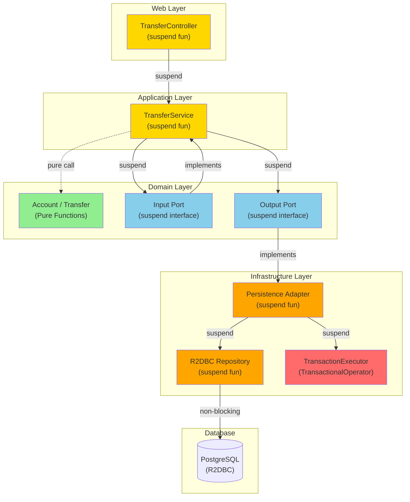
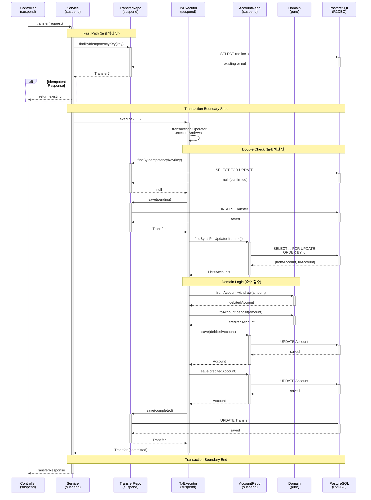
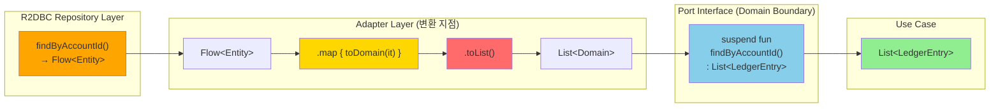
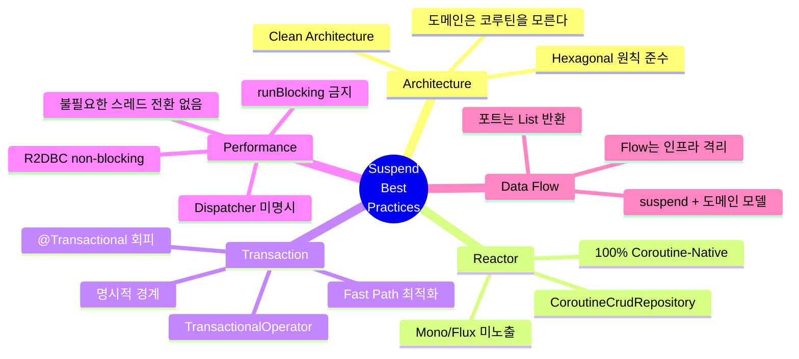

# Account Ledger Service - Suspend 함수 분석 & Best Practice

> **작성일**: 2026-02-09
> **버전**: 1.0
> **관련 Issue**: [#20](https://github.com/seokrae-labs/account-ledger-service/issues/20)

## 📋 목차
1. [아키텍처 다이어그램](#1-아키텍처-다이어그램)
2. [프로젝트 Suspend 현황 요약](#2-프로젝트-suspend-현황-요약)
3. [아키텍처별 분석](#3-아키텍처별-분석)
4. [Best Practice 체크리스트](#4-best-practice-체크리스트)
5. [Spring WebFlux + Coroutine Best Practice](#5-spring-webflux--coroutine-best-practice-총정리)
6. [결론](#6-결론)

---

## Context

이 문서는 **Spring WebFlux + Kotlin Coroutines + R2DBC** 기술 스택에서 suspend 함수를 올바르게 사용하는 방법을 정리한다. Account Ledger Service의 실제 구현을 분석하여 best practice를 추출하였다.

---

## 1. 아키텍처 다이어그램

### 1.1 Hexagonal Architecture with Suspend Layers



**핵심 포인트**:
- 🟢 **Domain Models**: Pure functions (코루틴-free)
- 🔵 **Ports**: suspend interface (도메인 경계)
- 🟡 **Application/Web**: suspend fun
- 🟠 **Infrastructure**: suspend + Flow (내부 변환)
- 🔴 **Transaction**: Programmatic (TransactionalOperator)

---

### 1.2 Transfer Call Chain with Transaction Boundary



**핵심 패턴**:
1. ⚡ **Fast Path**: 트랜잭션 밖에서 중복 체크
2. 🔒 **Double-Check**: 트랜잭션 안에서 재확인 (race condition 방지)
3. 🔐 **Deadlock Prevention**: 계좌 ID 정렬 후 FOR UPDATE
4. 🟢 **Domain Logic**: withdraw/deposit은 순수 함수
5. 💾 **Atomic Commit**: 모든 변경사항 일괄 커밋

---

### 1.3 Flow to List Conversion Point



**Why List over Flow?**
- ✅ 포트 인터페이스 단순화
- ✅ 도메인은 컬렉션 타입만 이해
- ✅ 트랜잭션 범위 명확화
- 🔸 스트리밍 필요 시에만 Flow를 포트에 노출

---

### 1.4 Best Practice Rules Overview



**8가지 핵심 규칙**:
1. 🏛️ **도메인은 코루틴을 모른다**
2. 🚫 **Reactor 타입을 코드 표면에 노출하지 않는다**
3. 📦 **CoroutineCrudRepository를 사용한다**
4. 💉 **@Transactional 대신 TransactionalOperator를 사용한다**
5. ⚡ **Dispatcher를 명시하지 않는다**
6. 🌊 **Flow는 인프라 경계에서 수집한다**
7. 🚷 **runBlocking을 사용하지 않는다**
8. 🎯 **트랜잭션 범위를 최소화한다**

---

## 2. 프로젝트 Suspend 현황 요약

### 레이어별 Suspend 사용 현황

| 레이어 | suspend 사용 | Flow 사용 | Mono/Flux 사용 |
|--------|:-----------:|:---------:|:--------------:|
| Domain Models | ❌ NO | ❌ NO | ❌ NO |
| Domain Ports (Interface) | ✅ YES (14개) | ❌ NO | ❌ NO |
| Application Services | ✅ YES (4개) | ❌ NO | ❌ NO |
| Persistence Adapters | ✅ YES (10개) | 🔸 내부만 | ❌ NO |
| R2DBC Repositories | ✅ YES (3개 커스텀) | 🔸 1개 | ❌ NO |
| Web Controllers | ✅ YES (4개) | ❌ NO | ❌ NO |
| Exception Handler | ❌ NO | ❌ NO | ❌ NO |

**총 36개 suspend 함수 선언**, Reactor 타입(Mono/Flux)이 코드 표면에 전혀 노출되지 않음.

### 주요 특징
- ✅ **100% Coroutine-Native**: Mono/Flux 없이 순수 Kotlin Coroutines
- ✅ **Clean Architecture**: 도메인 모델은 코루틴-free
- ✅ **Flow 격리**: Flow는 인프라 레이어에 국한, 포트 경계는 suspend + List
- ✅ **명시적 트랜잭션**: `@Transactional` 대신 `TransactionalOperator.executeAndAwait`

---

## 3. 아키텍처별 분석

### 3.1 Domain Layer - Coroutine-Free (✅ EXCELLENT)

```kotlin
// domain/Account.kt
data class Account(
    val id: Long?,
    val balance: BigDecimal,
    val version: Long?
) {
    fun deposit(amount: BigDecimal): Account {
        require(amount > BigDecimal.ZERO) { "Amount must be positive" }
        return copy(balance = balance + amount)
    }

    fun withdraw(amount: BigDecimal): Account {
        require(amount > BigDecimal.ZERO) { "Amount must be positive" }
        require(balance >= amount) { "Insufficient balance" }
        return copy(balance = balance - amount)
    }
}
```

**평가**: **EXCELLENT** ⭐⭐⭐
- 도메인 모델이 코루틴에 의존하지 않음
- 비즈니스 로직은 순수 동기 함수로 표현
- 테스트 용이성 극대화

---

### 3.2 Port Interfaces - All Suspend, No Flow (✅ EXCELLENT)

#### Input Port (Use Case)
```kotlin
interface DepositUseCase {
    suspend fun execute(accountId: Long, amount: BigDecimal, description: String?): Account
}
```

#### Output Port (Repository)
```kotlin
interface AccountRepository {
    suspend fun save(account: Account): Account
    suspend fun findById(id: Long): Account?
    suspend fun findByIdForUpdate(id: Long): Account?
}
```

#### Infrastructure Port
```kotlin
interface TransactionExecutor {
    suspend fun <T> execute(block: suspend () -> T): T
}
```

**평가**: **EXCELLENT** ⭐⭐⭐
- 포트 경계에서 **Flow가 아닌 suspend + List**로 통일
- **도메인 모델만 반환** (Entity, DTO 노출 없음)
- Hexagonal Architecture 원칙 완벽 준수

---

### 3.3 Transaction Management - Programmatic (✅ EXCELLENT)

#### Port (Domain Layer)
```kotlin
interface TransactionExecutor {
    suspend fun <T> execute(block: suspend () -> T): T
}
```

#### Implementation (Infrastructure Layer)
```kotlin
@Component
class R2dbcTransactionExecutor(
    private val transactionalOperator: TransactionalOperator
) : TransactionExecutor {
    override suspend fun <T> execute(block: suspend () -> T): T {
        return transactionalOperator.executeAndAwait { block() }!!
    }
}
```

**평가**: **EXCELLENT** ⭐⭐⭐

#### 왜 `@Transactional`을 쓰지 않았나?
1. **Hexagonal Architecture 원칙 준수**: 도메인이 Spring에 무의존
2. **명시적 트랜잭션 경계**: 어디서 시작/끝인지 코드로 보임
3. **R2DBC + Coroutine 안정성**: `@Transactional`의 불안정한 context 전파 문제 회피

#### Reference
- [Spring Data R2DBC - Programmatic Transactions](https://docs.spring.io/spring-data/r2dbc/docs/current/reference/html/#r2dbc.transactions)
- [Kotlin Coroutines Context Propagation Issues](https://github.com/spring-projects/spring-framework/issues/22462)

---

### 3.4 Flow → List 변환 (Adapter 경계) (✅ GOOD)

#### R2DBC Repository - Flow 반환
```kotlin
interface LedgerEntryEntityRepository : CoroutineCrudRepository<LedgerEntryEntity, Long> {
    fun findByAccountId(accountId: Long): Flow<LedgerEntryEntity>  // Flow
}
```

#### Persistence Adapter - List로 변환
```kotlin
override suspend fun findByAccountId(accountId: Long): List<LedgerEntry> {
    return repository.findByAccountId(accountId)
        .map { toDomain(it) }
        .toList()  // Flow → List (suspend terminal operator)
}
```

**평가**: **GOOD** ⭐⭐

**Why List over Flow?**
- ✅ 포트 인터페이스 단순화 (Flow는 스트리밍 전용)
- ✅ 현재 use case는 전체 데이터 필요 (스트리밍 불필요)
- ✅ 트랜잭션 범위 명확화

**When to Use Flow?**
- 대량 데이터 스트리밍 (예: 수백만 건 이체 내역)
- 점진적 UI 렌더링
- Server-Sent Events (SSE)

---

### 3.5 Call Chain 추적 (Transfer - 가장 복잡한 케이스)

```
TransferController.transfer()                    [suspend]
  → TransferService.execute()                    [suspend]
    → transferRepo.findByIdempotencyKey()        [suspend, 트랜잭션 밖 - Fast Path]
    → transactionExecutor.execute {              [suspend, 트랜잭션 시작]
        transferRepo.findByIdempotencyKey()      [suspend, Double-Check]
        transferRepo.save(pending)               [suspend]
        accountRepo.findByIdsForUpdate(sorted)   [suspend, FOR UPDATE + ORDER BY]
        fromAccount.withdraw(amount)             [동기, 도메인 로직]
        toAccount.deposit(amount)                [동기, 도메인 로직]
        accountRepo.save(debited)                [suspend]
        accountRepo.save(credited)               [suspend]
        ledgerEntryRepo.saveAll(entries)         [suspend]
        transferRepo.save(completed)             [suspend]
      }                                          [트랜잭션 커밋/롤백]
```

**핵심 패턴**:
1. **Idempotent Fast Path**: 트랜잭션 밖에서 중복 체크
2. **Double-Check**: 트랜잭션 안에서 재확인 (race condition 방지)
3. **Deadlock Prevention**: 계좌 ID 정렬 후 FOR UPDATE
4. **도메인 로직**: `withdraw()`, `deposit()`은 순수 함수 (suspend 아님)

---

### 3.6 Dispatcher 설정

**명시적 Dispatcher 설정 없음** - 전체 코드에서 `Dispatchers.IO`, `withContext`, `CoroutineScope` 사용 없음.

**평가**: **CORRECT** ✅

#### Why No Explicit Dispatcher?
- R2DBC는 **완전 non-blocking** (event loop 기반)
- 불필요한 스레드 전환은 오히려 성능 저하
- Spring WebFlux가 자동으로 Reactor event loop 활용

#### When to Use `Dispatchers.IO`?
```kotlin
// ❌ R2DBC에서는 불필요
suspend fun save(account: Account) = withContext(Dispatchers.IO) {
    repository.save(account)  // 이미 non-blocking
}

// ✅ Blocking I/O가 필요한 경우만
suspend fun readFile(path: String) = withContext(Dispatchers.IO) {
    File(path).readText()  // blocking operation
}
```

---

## 4. Best Practice 체크리스트

### ✅ 잘 지키고 있는 것

| # | Best Practice | 현재 상태 | 레퍼런스 |
|---|--------------|----------|---------|
| 1 | 도메인 모델에 코루틴 의존성 없음 | ✅ PASS | Clean Architecture |
| 2 | 포트 인터페이스에서 suspend 사용 (Mono/Flux 아님) | ✅ PASS | [Spring Docs](https://docs.spring.io/spring-framework/reference/languages/kotlin/coroutines.html) |
| 3 | CoroutineCrudRepository 사용 | ✅ PASS | Spring Data R2DBC |
| 4 | TransactionalOperator.executeAndAwait 사용 | ✅ PASS | [R2DBC Docs](https://docs.spring.io/spring-data/r2dbc/docs/current/reference/html/#r2dbc.transactions) |
| 5 | @Transactional 미사용 (context 전파 이슈 회피) | ✅ PASS | [Issue #22462](https://github.com/spring-projects/spring-framework/issues/22462) |
| 6 | Flow를 어댑터 경계에서 List로 변환 | ✅ PASS | Domain-Driven Design |
| 7 | 예외가 suspend chain을 자연스럽게 전파 | ✅ PASS | Kotlin Coroutines |
| 8 | Spring 예외 → 도메인 예외 번역 | ✅ PASS | Hexagonal Architecture |
| 9 | 불필요한 Dispatcher 전환 없음 | ✅ PASS | Performance |
| 10 | runBlocking 미사용 | ✅ PASS | Non-Blocking |
| 11 | 컨트롤러에서 suspend fun 직접 반환 | ✅ PASS | Spring WebFlux |
| 12 | 트랜잭션 밖 Fast Path 최적화 | ✅ PASS | Idempotency Pattern |

---

### 🔸 개선 가능한 포인트

| # | 항목 | 현재 | 개선안 | 우선순위 |
|---|------|------|--------|---------|
| 1 | `executeAndAwait`의 `!!` (non-null assertion) | `block()!!` | block이 null 반환 가능 시 에러 메시지 불명확. 현재 block은 항상 non-null 반환하므로 실질적 문제는 없음 | 🟢 LOW |
| 2 | 에러 처리에 `Result<T>` 미사용 | 예외 기반 | 현재 접근이 Spring 생태계와 더 자연스러움. 변경 불필요 | 🟢 LOW |
| 3 | 병렬 실행 미활용 | 순차 실행 | Transfer에서 debit/credit 계좌 save를 `coroutineScope { async {} }`로 병렬화 가능하나, 트랜잭션 내부이므로 이점 미미 | 🟢 LOW |

**결론**: 실질적으로 개선이 필요한 critical 이슈 없음.

---

## 5. Spring WebFlux + Coroutine Best Practice 총정리

### Rule 1: 도메인은 코루틴을 모른다 🏛️

```kotlin
// ✅ GOOD: 순수 함수
fun deposit(amount: BigDecimal): Account = copy(balance = balance + amount)

// ❌ BAD: 도메인에 suspend
suspend fun deposit(amount: BigDecimal): Account  // 도메인이 I/O를 알 필요 없음
```

**Why?**
- 비즈니스 로직의 순수성 보장
- 테스트 용이성 (코루틴 없이 테스트 가능)
- 도메인 모델의 재사용성 증가

---

### Rule 2: Reactor 타입을 코드 표면에 노출하지 않는다 🚫

```kotlin
// ✅ GOOD
suspend fun findById(id: Long): Account?

// ❌ BAD
fun findById(id: Long): Mono<Account>
```

**Why?**
- Coroutines가 더 자연스러운 Kotlin 코드
- `.awaitSingle()` 같은 변환 코드 불필요
- WebFlux 구현 세부사항 숨김 (Hexagonal Architecture)

---

### Rule 3: CoroutineCrudRepository를 사용한다 📦

```kotlin
// ✅ GOOD
interface AccountRepo : CoroutineCrudRepository<AccountEntity, Long>

// ❌ BAD (불필요한 .awaitSingle() 변환 필요)
interface AccountRepo : ReactiveCrudRepository<AccountEntity, Long>
```

**Dependency**:
```gradle
implementation("org.springframework.boot:spring-boot-starter-data-r2dbc")
```

---

### Rule 4: @Transactional 대신 TransactionalOperator를 사용한다 💉

```kotlin
// ✅ GOOD: 명시적, 안정적
transactionalOperator.executeAndAwait { ... }

// ⚠️ RISKY: R2DBC + coroutine에서 context 전파 이슈 가능
@Transactional
suspend fun execute() { ... }
```

**Why?**
- Hexagonal Architecture: 도메인이 Spring annotation에 무의존
- 명시적 트랜잭션 경계 (코드로 보임)
- R2DBC + Coroutine context 전파 문제 회피

**Setup**:
```kotlin
@Configuration
class TransactionConfiguration {
    @Bean
    fun transactionalOperator(
        transactionManager: ReactiveTransactionManager
    ): TransactionalOperator {
        return TransactionalOperator.create(transactionManager)
    }
}
```

---

### Rule 5: Dispatcher를 명시하지 않는다(R2DBC는 non-blocking) ⚡

```kotlin
// ✅ GOOD: 기본 Reactor event loop 사용
suspend fun save(account: Account): Account {
    return repository.save(entity)
}

// ❌ BAD: 불필요한 스레드 전환
suspend fun save(account: Account): Account = withContext(Dispatchers.IO) {
    repository.save(entity)  // R2DBC는 이미 non-blocking
}
```

**When to Use `Dispatchers.IO`?**
- Blocking I/O (파일, 레거시 JDBC)
- CPU-intensive work (암호화, 압축)

**When NOT to Use?**
- R2DBC, WebClient, MongoDB Reactive 등 **모든 non-blocking I/O**

---

### Rule 6: Flow는 인프라 경계에서 수집한다 🌊

```kotlin
// ✅ GOOD: Port는 List, Adapter에서 toList()
interface LedgerEntryRepository {
    suspend fun findByAccountId(accountId: Long): List<LedgerEntry>
}

// 🔸 스트리밍이 필요한 경우에만 Flow를 포트에 노출
interface LedgerEntryRepository {
    fun streamByAccountId(accountId: Long): Flow<LedgerEntry>  // 대량 데이터
}
```

**When to Use Flow in Ports?**
- 수백만 건 데이터 스트리밍
- Server-Sent Events (SSE)
- 점진적 UI 업데이트

---

### Rule 7: runBlocking을 사용하지 않는다 🚷

```kotlin
// ✅ GOOD: 전체 체인이 suspend
suspend fun execute(): Account { ... }

// ❌ BAD: event loop 블로킹
fun execute(): Account = runBlocking { ... }
```

**Exception**: Test에서만 허용
```kotlin
@Test
fun `test transfer`() = runBlocking {
    val result = transferUseCase.execute(...)
    assertThat(result.status).isEqualTo(TransferStatus.COMPLETED)
}
```

---

### Rule 8: 트랜잭션 범위를 최소화한다 🎯

```kotlin
// ✅ GOOD: Fast path는 트랜잭션 밖
val existing = repo.findByKey(key)  // 밖
if (existing != null) return existing
return transactionExecutor.execute {
    // 최소한의 작업만 트랜잭션 안에서
}

// ❌ BAD: 전체를 트랜잭션으로 감쌈
return transactionExecutor.execute {
    val existing = repo.findByKey(key)  // 불필요하게 트랜잭션 안
    if (existing != null) return@execute existing
    // ...
}
```

**Benefits**:
- DB 연결 풀 효율성 증가
- Lock 시간 최소화
- Throughput 향상

---

## 6. 결론

### 🎯 프로젝트 평가

이 프로젝트는 **Spring WebFlux + Kotlin Coroutines + R2DBC** 조합의 best practice를 매우 잘 따르고 있음:

| 평가 항목 | 점수 |
|----------|------|
| Coroutine-Native Architecture | ⭐⭐⭐⭐⭐ |
| Clean/Hexagonal Architecture | ⭐⭐⭐⭐⭐ |
| Transaction Management | ⭐⭐⭐⭐⭐ |
| Performance Optimization | ⭐⭐⭐⭐⭐ |
| Code Readability | ⭐⭐⭐⭐⭐ |

### 🏆 주요 강점

1. **100% Coroutine-Native**: Mono/Flux가 코드 표면에 전혀 노출되지 않음
2. **Clean Architecture 원칙**: 도메인은 코루틴-free, 트랜잭션도 포트로 추상화
3. **안정적 트랜잭션**: `@Transactional` 대신 `TransactionalOperator.executeAndAwait`
4. **적절한 성능 최적화**: 멱등성 fast-path, deadlock prevention 패턴

### 📚 Reference Implementation

실질적으로 개선이 필요한 부분은 거의 없으며, **현재 구조가 이 기술 스택의 reference implementation 수준**.

향후 유사 프로젝트에서 이 구조를 template으로 활용 가능.

---

## 📖 참고 자료

- [Spring Framework - Kotlin Coroutines](https://docs.spring.io/spring-framework/reference/languages/kotlin/coroutines.html)
- [Spring Data R2DBC Reference](https://docs.spring.io/spring-data/r2dbc/docs/current/reference/html/)
- [Kotlin Coroutines Guide](https://kotlinlang.org/docs/coroutines-guide.html)
- [R2DBC Official Site](https://r2dbc.io/)
- [Hexagonal Architecture by Alistair Cockburn](https://alistair.cockburn.us/hexagonal-architecture/)

---

**문서 작성**: Claude Code
**검토 필요**: suspend 함수 사용 시 참고 문서로 활용
**마지막 업데이트**: 2026-02-09
