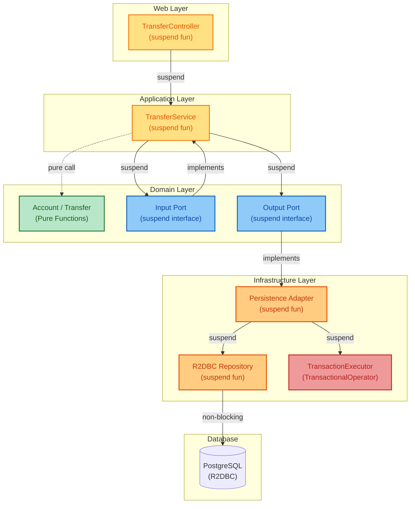
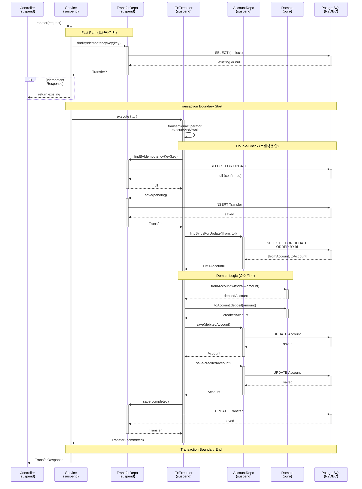
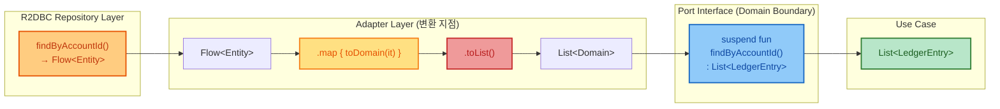
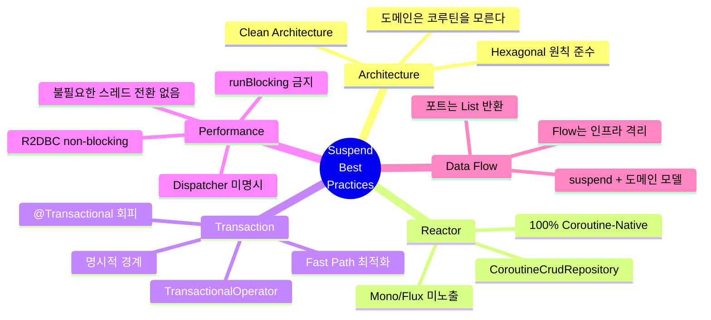

# Account Ledger Service - Suspend 함수 분석 & Best Practice

> **작성일**: 2026-02-09
> **버전**: 1.0
> **관련 Issue**: [#20](https://github.com/seokrae-labs/account-ledger-service/issues/20)

## 📋 목차
1. [기본 개념](#1-기본-개념)
2. [아키텍처 다이어그램](#2-아키텍처-다이어그램)
3. [레이어별 Suspend 심층 분석](#3-레이어별-suspend-심층-분석)
4. [프로젝트 Suspend 현황 요약](#4-프로젝트-suspend-현황-요약)
5. [아키텍처별 분석](#5-아키텍처별-분석)
6. [Best Practice 체크리스트](#6-best-practice-체크리스트)
7. [Spring WebFlux + Coroutine Best Practice](#7-spring-webflux--coroutine-best-practice-총정리)
8. [결론](#8-결론)

---

## Context

이 문서는 **Spring WebFlux + Kotlin Coroutines + R2DBC** 기술 스택에서 suspend 함수를 올바르게 사용하는 방법을 정리한다. Account Ledger Service의 실제 구현을 분석하여 best practice를 추출하였다.

---

## 1. 기본 개념

### suspend 함수란?

`suspend`는 Kotlin Coroutines의 핵심 키워드로, **일시 중단 가능한 함수**를 의미합니다.

#### 일반 함수 vs Suspend 함수

```kotlin
// ❌ 일반 함수 (Blocking)
fun findById(id: Long): Account {
    // DB 조회하는 동안 스레드를 점유하고 대기
    return jdbcTemplate.queryForObject(...)  // 스레드 블로킹
}

// ✅ Suspend 함수 (Non-Blocking)
suspend fun findById(id: Long): Account {
    // DB 조회하는 동안 스레드를 반납하고 다른 작업 수행
    return repository.findById(id)  // 코루틴 일시 중단
}
```

#### 핵심 차이점

| 구분 | 일반 함수 (Blocking) | Suspend 함수 (Non-Blocking) |
|------|---------------------|---------------------------|
| **스레드 사용** | I/O 대기 중 스레드 점유 | I/O 대기 중 스레드 반납 |
| **동시성** | 스레드 수만큼 제한 | 수만 개 동시 요청 처리 가능 |
| **성능** | 스레드 풀 고갈 가능 | 높은 처리량 |
| **호출 방법** | 어디서나 호출 가능 | suspend 함수 내에서만 호출 |

#### 실무 예시: 이체 처리

```kotlin
// Blocking 방식 (전통적인 JDBC)
@Transactional
fun transfer(from: Long, to: Long, amount: BigDecimal): Transfer {
    val fromAccount = accountRepository.findById(from)  // 스레드 대기
    val toAccount = accountRepository.findById(to)      // 스레드 대기

    fromAccount.withdraw(amount)
    toAccount.deposit(amount)

    accountRepository.save(fromAccount)  // 스레드 대기
    accountRepository.save(toAccount)    // 스레드 대기

    return transferRepository.save(...)  // 스레드 대기
}
// ⚠️ 문제: 5번의 DB I/O 동안 스레드가 계속 점유됨

// Non-Blocking 방식 (R2DBC + Coroutines)
suspend fun transfer(from: Long, to: Long, amount: BigDecimal): Transfer {
    val fromAccount = accountRepository.findById(from)  // 일시 중단
    val toAccount = accountRepository.findById(to)      // 일시 중단

    fromAccount.withdraw(amount)
    toAccount.deposit(amount)

    accountRepository.save(fromAccount)  // 일시 중단
    accountRepository.save(toAccount)    // 일시 중단

    return transferRepository.save(...)  // 일시 중단
}
// ✅ 장점: 5번의 DB I/O 동안 스레드를 반납하여 다른 요청 처리
```

#### 왜 Suspend를 사용하는가?

1. **높은 처리량**: 적은 스레드로 많은 요청 처리
2. **확장성**: I/O 대기 시간에 스레드를 재활용
3. **자원 효율**: 스레드 풀 크기를 줄여도 성능 유지
4. **자연스러운 코드**: 동기 코드처럼 작성하면서 비동기 이점

---

## 2. 아키텍처 다이어그램

### 2.1 Hexagonal Architecture with Suspend Layers

**이 다이어그램이 보여주는 것:**

이 다이어그램은 **Hexagonal Architecture(육각형 아키텍처)** 에서 각 레이어가 어떻게 suspend 함수를 사용하는지 보여줍니다.

- **도메인 레이어(중심)**: 순수 함수, suspend 없음 (비즈니스 로직은 I/O와 무관)
- **포트 인터페이스**: suspend로 I/O 경계 정의
- **외부 레이어**: suspend로 실제 I/O 수행

**핵심 메시지:**
> "도메인은 I/O를 모르고, 포트가 suspend로 I/O 경계를 추상화한다"



**핵심 포인트**:
- 🌿 **Domain Models**: Pure functions (코루틴-free)
- 💠 **Ports**: suspend interface (도메인 경계)
- 🌟 **Application/Web**: suspend fun
- 🔶 **Infrastructure**: suspend + Flow (내부 변환)
- 🔺 **Transaction**: Programmatic (TransactionalOperator)

---

### 2.2 Transfer Call Chain with Transaction Boundary

**이 다이어그램이 보여주는 것:**

이 시퀀스 다이어그램은 **이체 요청의 전체 흐름**을 시간 순서대로 보여줍니다.

- **Fast Path (트랜잭션 밖)**: 중복 요청 빠른 응답 (성능 최적화)
- **Transaction Boundary (경계)**: 어디서 트랜잭션이 시작/끝나는지 명확히 표시
- **Double-Check**: 트랜잭션 안에서 다시 확인 (race condition 방지)
- **Deadlock Prevention**: 계좌 ID 순서로 잠금 (교착상태 방지)
- **Domain Logic**: 순수 함수 호출 (suspend 아님)

**핵심 메시지:**
> "suspend 함수 체인을 통해 비동기 흐름을 동기 코드처럼 표현하면서, 트랜잭션 경계와 성능 최적화를 명확히 구분한다"



**핵심 패턴**:
1. ⚡ **Fast Path**: 트랜잭션 밖에서 중복 체크
2. 🔒 **Double-Check**: 트랜잭션 안에서 재확인 (race condition 방지)
3. 🔐 **Deadlock Prevention**: 계좌 ID 정렬 후 FOR UPDATE
4. 🟢 **Domain Logic**: withdraw/deposit은 순수 함수
5. 💾 **Atomic Commit**: 모든 변경사항 일괄 커밋

---

### 2.3 Flow to List Conversion Point

**이 다이어그램이 보여주는 것:**

이 다이어그램은 **Kotlin Flow를 어디서 List로 변환하는지** 보여줍니다.

- **R2DBC Repository**: 데이터를 Flow로 반환 (스트림)
- **Adapter (변환 지점)**: `.toList()`로 Flow → List 변환
- **Port Interface**: 도메인은 List만 이해 (Flow를 모름)

**핵심 메시지:**
> "Flow는 인프라 레이어에 격리하고, 도메인 경계(Port)는 익숙한 컬렉션 타입(List)으로 추상화한다"

**왜 List로 변환하는가?**
- 도메인 로직은 전체 데이터를 필요로 함 (예: 계좌 거래 내역 전체 조회)
- 스트리밍이 필요한 경우(수백만 건)에만 Flow를 포트까지 노출



**Why List over Flow?**
- ✅ 포트 인터페이스 단순화
- ✅ 도메인은 컬렉션 타입만 이해
- ✅ 트랜잭션 범위 명확화
- 🔸 스트리밍 필요 시에만 Flow를 포트에 노출

---

### 2.4 Best Practice Rules Overview

**이 다이어그램이 보여주는 것:**

이 마인드맵은 **8가지 Suspend Best Practice 규칙**을 5개 카테고리로 분류하여 보여줍니다.

- **Architecture**: 아키텍처 설계 원칙 (도메인 분리, Clean Architecture)
- **Reactor**: Reactor 타입 처리 방법 (Mono/Flux 숨김)
- **Transaction**: 트랜잭션 관리 전략 (TransactionalOperator 사용)
- **Performance**: 성능 최적화 (Dispatcher 최소화)
- **Data Flow**: 데이터 흐름 제어 (Flow 격리)

**핵심 메시지:**
> "Suspend 함수를 올바르게 사용하려면 아키텍처, 트랜잭션, 성능, 데이터 흐름 전반에 걸친 종합적 이해가 필요하다"



**8가지 핵심 규칙**:
1. 🏛️ **도메인은 코루틴을 모른다**
2. 🚫 **Reactor 타입을 코드 표면에 노출하지 않는다**
3. 📦 **CoroutineCrudRepository를 사용한다**
4. 💉 **@Transactional 대신 TransactionalOperator를 사용한다**
5. ⚡ **Dispatcher를 명시하지 않는다**
6. 🌊 **Flow는 인프라 경계에서 수집한다**
7. 🚷 **runBlocking을 사용하지 않는다**
8. 🎯 **트랜잭션 범위를 최소화한다**

---

## 3. 레이어별 Suspend 심층 분석

> **읽는 순서**: Database(시작점) → Infrastructure → Domain → Application → Web (요청 흐름의 역순)

이 섹션에서는 각 레이어별로 **왜**, **어떻게**, **무엇을** suspend로 처리하는지, 그리고 **검증 방법**을 상세히 설명합니다.

---

### 3.1 Database Layer (R2DBC) - 시작점

#### 왜 여기가 시작점인가?

모든 suspend의 근원은 **Database I/O**입니다. R2DBC는 완전히 non-blocking으로 설계된 데이터베이스 드라이버이며, 이것이 전체 애플리케이션을 suspend 기반으로 만드는 이유입니다.

#### 동작 방식

```kotlin
// R2DBC가 내부적으로 하는 일
interface R2dbcEntityOperations {
    // Reactor 타입 반환 (내부 구현)
    fun <T> select(query: Query, entityClass: Class<T>): Flux<T>

    // 실제로는 이런 식으로 동작:
    // 1. SQL 쿼리를 네트워크로 전송
    // 2. 스레드를 반납하고 대기
    // 3. DB가 응답하면 이벤트 루프에서 재개
    // 4. 결과를 Flux로 스트리밍
}
```

**R2DBC의 핵심:**
```
Traditional JDBC (Blocking):
Thread --[SQL]---> DB --[wait]---> Response
        └─ 스레드가 DB 응답까지 대기 (수 ms ~ 수백 ms)

R2DBC (Non-Blocking):
Thread --[SQL]---> DB
  ↓ (스레드 반납)
  ... (다른 요청 처리)
  ↓ (DB 응답 도착)
Callback --[Response]---> 처리 재개
```

#### 실제 코드 예제

```kotlin
// src/main/kotlin/com/labs/ledger/adapter/out/persistence/repository/AccountEntityRepository.kt
interface AccountEntityRepository : CoroutineCrudRepository<AccountEntity, Long> {

    // R2DBC가 제공하는 suspend 함수
    // 내부적으로 Mono<AccountEntity>를 반환하지만,
    // CoroutineCrudRepository가 자동으로 .awaitSingle()을 호출
    override suspend fun findById(id: Long): AccountEntity?

    // 커스텀 쿼리도 suspend
    @Query("""
        SELECT * FROM accounts
        WHERE id = ANY(:ids)
        ORDER BY id
        FOR UPDATE
    """)
    suspend fun findByIdsForUpdate(ids: List<Long>): List<AccountEntity>
}
```

#### 내부 동작 흐름

```
1. findById(1L) 호출
   ↓
2. R2DBC가 SQL 생성: "SELECT * FROM accounts WHERE id = 1"
   ↓
3. PostgreSQL에 네트워크 요청 전송
   ↓
4. 코루틴이 suspend (스레드 반납)
   ↓
   [이 시점에 스레드는 다른 요청 처리 가능]
   ↓
5. PostgreSQL 응답 도착 (예: 5ms 후)
   ↓
6. Reactor event loop가 응답 수신
   ↓
7. 코루틴 재개 (continuation.resume())
   ↓
8. AccountEntity 반환
```

#### 검증 방법

**1. 실제로 non-blocking인지 확인:**

```kotlin
@SpringBootTest
class R2dbcNonBlockingTest {

    @Autowired
    lateinit var repository: AccountEntityRepository

    @Test
    fun `R2DBC는 스레드를 블로킹하지 않는다`() = runBlocking {
        val startThread = Thread.currentThread().name
        println("시작 스레드: $startThread")

        // DB I/O 수행
        val account = repository.findById(1L)

        val endThread = Thread.currentThread().name
        println("종료 스레드: $endThread")

        // 스레드가 다를 수 있음 (non-blocking 증거)
        // 출력 예: 시작: reactor-http-nio-2, 종료: reactor-http-nio-3
    }

    @Test
    fun `동시에 1000개 요청 처리 가능`() = runBlocking {
        val start = System.currentTimeMillis()

        // 1000개 동시 요청
        val results = (1..1000).map { id ->
            async {
                repository.findById(id.toLong())
            }
        }.awaitAll()

        val duration = System.currentTimeMillis() - start

        // Blocking JDBC였다면 10초 이상 소요 (스레드 풀 고갈)
        // R2DBC는 1초 이내 완료 (non-blocking)
        assertThat(duration).isLessThan(2000)
    }
}
```

**2. 스레드 사용량 모니터링:**

```kotlin
@Test
fun `스레드 사용량 확인`() = runBlocking {
    val threadsBefore = Thread.getAllStackTraces().keys.size

    // 1000개 동시 DB 조회
    repeat(1000) {
        launch {
            repository.findById(it.toLong())
        }
    }

    val threadsAfter = Thread.getAllStackTraces().keys.size

    // 스레드 수가 거의 증가하지 않음 (보통 10개 미만)
    assertThat(threadsAfter - threadsBefore).isLessThan(10)
}
```

#### 안티패턴

```kotlin
// ❌ BAD: R2DBC Repository를 blocking으로 호출
fun findAccount(id: Long): Account = runBlocking {
    repository.findById(id)  // 코루틴 블로킹!
}

// ✅ GOOD: suspend 체인 유지
suspend fun findAccount(id: Long): Account {
    return repository.findById(id)
}
```

---

### 3.2 Infrastructure Layer (Adapter) - 변환과 격리

#### 왜 여기서 suspend를 쓰는가?

Adapter는 **외부 세계(R2DBC, 네트워크)와 도메인을 연결**하는 다리입니다. 외부 I/O가 suspend이므로, Adapter도 자연스럽게 suspend입니다.

#### 이 레이어의 책임

1. **Entity ↔ Domain 변환**: DB 엔티티를 도메인 모델로 변환
2. **Flow 격리**: Flow를 List로 변환하여 도메인에 노출하지 않음
3. **예외 번역**: Infrastructure 예외를 도메인 예외로 변환

#### 실제 코드 예제

```kotlin
// src/main/kotlin/com/labs/ledger/adapter/out/persistence/adapter/AccountPersistenceAdapter.kt
@Component
class AccountPersistenceAdapter(
    private val accountRepository: AccountEntityRepository,
    private val ledgerEntryRepository: LedgerEntryEntityRepository
) : AccountRepository {  // Domain Port 구현

    // 1. 단순 조회: suspend 체인
    override suspend fun findById(id: Long): Account? {
        return accountRepository.findById(id)
            ?.let { toDomain(it) }  // Entity → Domain 변환
    }

    // 2. FOR UPDATE: 트랜잭션 내에서 잠금
    override suspend fun findByIdForUpdate(id: Long): Account? {
        return accountRepository.findByIdForUpdate(id)
            ?.let { toDomain(it) }
    }

    // 3. Flow → List 변환 (중요!)
    override suspend fun findLedgerEntries(accountId: Long): List<LedgerEntry> {
        return ledgerEntryRepository
            .findByAccountId(accountId)  // Flow<Entity> 반환
            .map { toDomain(it) }        // Flow<Domain>
            .toList()                     // suspend 함수로 수집
    }

    // 4. 저장: 예외 번역 포함
    override suspend fun save(account: Account): Account {
        return try {
            val entity = toEntity(account)
            val saved = accountRepository.save(entity)
            toDomain(saved)
        } catch (e: OptimisticLockingFailureException) {
            // Infrastructure 예외 → Domain 예외
            throw ConcurrentModificationException("Account was modified", e)
        }
    }
}
```

#### 동작 방식: Flow → List 변환

**왜 toList()를 호출하는가?**

```kotlin
// Flow는 "차가운" 스트림 (구독 전까지 실행 안 됨)
fun findByAccountId(accountId: Long): Flow<LedgerEntry> {
    return flow {
        // 이 블록은 toList() 호출 시점에 실행됨
        emit(entry1)
        emit(entry2)
        emit(entry3)
    }
}

// toList()는 terminal operator (종단 연산자)
suspend fun toList(): List<T> {
    // 1. Flow 구독
    // 2. 모든 emit 수집
    // 3. List로 반환
    // 4. suspend이므로 수집 중 스레드 반납 가능
}
```

**실행 흐름:**

```
1. repository.findByAccountId(1L)
   ↓ (Flow 생성, 아직 실행 안 됨)
2. .map { toDomain(it) }
   ↓ (변환 로직 등록)
3. .toList()  ← 여기서 실제 실행
   ↓
4. DB 쿼리 실행: SELECT * FROM ledger_entries WHERE account_id = 1
   ↓
5. 각 row마다:
   - emit(entity)
   - map 적용 (Entity → Domain)
   - List에 추가
   ↓ (suspend: DB에서 다음 row 대기)
6. List<LedgerEntry> 반환
```

#### 검증 방법

**1. Flow가 실제로 lazy한지 확인:**

```kotlin
@Test
fun `Flow는 toList 호출 전까지 실행되지 않는다`() = runBlocking {
    var queryExecuted = false

    val flow = ledgerEntryRepository.findByAccountId(1L)
        .onStart { queryExecuted = true }  // Flow 시작 시 플래그

    // Flow 생성만 했으므로 쿼리 미실행
    assertThat(queryExecuted).isFalse()

    // toList() 호출 시점에 쿼리 실행
    flow.toList()
    assertThat(queryExecuted).isTrue()
}
```

**2. 예외 번역 테스트:**

```kotlin
@Test
fun `OptimisticLockingFailureException을 도메인 예외로 변환`() = runBlocking {
    val account = Account(id = 1L, balance = 1000.toBigDecimal(), version = 1L)

    // 버전 불일치 시나리오
    coEvery { accountRepository.save(any()) } throws
        OptimisticLockingFailureException("Version mismatch")

    // 도메인 예외로 변환되는지 확인
    assertThrows<ConcurrentModificationException> {
        adapter.save(account)
    }
}
```

#### 안티패턴

```kotlin
// ❌ BAD: Flow를 포트까지 노출
interface AccountRepository {
    fun findLedgerEntries(accountId: Long): Flow<LedgerEntry>  // 도메인이 Flow를 알아야 함
}

// ✅ GOOD: List로 변환하여 노출
interface AccountRepository {
    suspend fun findLedgerEntries(accountId: Long): List<LedgerEntry>
}

// ❌ BAD: runBlocking 사용
fun save(account: Account): Account = runBlocking {
    adapter.save(account)  // 스레드 블로킹!
}
```

---

### 3.3 Domain Layer (Ports) - 경계 정의

#### 왜 여기서 suspend를 쓰는가?

Port는 **I/O가 필요하다는 것을 알지만, 구체적인 구현은 모르는** 추상 경계입니다. suspend는 "이 작업은 I/O가 필요하다"는 시그니처입니다.

#### Port vs Domain Model

```kotlin
// ✅ Port Interface: suspend 사용
interface AccountRepository {
    suspend fun findById(id: Long): Account?
    suspend fun save(account: Account): Account
}

// ✅ Domain Model: suspend 없음 (순수 함수)
data class Account(
    val id: Long?,
    val balance: BigDecimal,
    val version: Long?
) {
    // 순수 함수: 메모리 연산만
    fun deposit(amount: BigDecimal): Account {
        require(amount > BigDecimal.ZERO)
        return copy(balance = balance + amount)
    }

    fun withdraw(amount: BigDecimal): Account {
        require(amount > BigDecimal.ZERO)
        require(balance >= amount)
        return copy(balance = balance - amount)
    }
}
```

#### 왜 Domain Model은 suspend가 아닌가?

**Domain-Driven Design 원칙:**

1. **도메인 로직은 I/O와 무관**: 비즈니스 규칙은 메모리 연산
2. **테스트 용이성**: 코루틴 없이 단위 테스트 가능
3. **재사용성**: 다른 컨텍스트(배치, 동기 API)에서도 사용 가능

**잘못된 설계:**

```kotlin
// ❌ BAD: 도메인 모델이 I/O를 수행
data class Account(
    val id: Long?,
    val balance: BigDecimal,
    private val auditRepository: AuditRepository  // ❌ 인프라 의존
) {
    suspend fun deposit(amount: BigDecimal): Account {  // ❌ suspend
        auditRepository.log("Deposit $amount")  // ❌ I/O 수행
        return copy(balance = balance + amount)
    }
}

// ✅ GOOD: 도메인 모델은 순수, Port가 I/O 담당
data class Account(...) {
    fun deposit(amount: BigDecimal): Account {
        return copy(balance = balance + amount)
    }
}

interface AuditPort {
    suspend fun log(message: String)  // Port가 I/O 정의
}
```

#### 검증 방법

**1. 도메인 모델 순수성 테스트:**

```kotlin
class AccountTest {

    @Test
    fun `deposit은 순수 함수다`() {
        // Given
        val account = Account(id = 1L, balance = 1000.toBigDecimal(), version = 1L)

        // When
        val result1 = account.deposit(500.toBigDecimal())
        val result2 = account.deposit(500.toBigDecimal())

        // Then: 같은 입력 → 같은 출력 (순수 함수)
        assertThat(result1).isEqualTo(result2)

        // Then: 원본 불변
        assertThat(account.balance).isEqualTo(1000.toBigDecimal())
    }

    @Test
    fun `도메인 로직은 코루틴 없이 테스트 가능`() {
        // runBlocking 불필요!
        val account = Account(id = 1L, balance = 1000.toBigDecimal(), version = 1L)

        assertThatThrownBy {
            account.withdraw(2000.toBigDecimal())
        }.isInstanceOf(IllegalArgumentException::class.java)
         .hasMessageContaining("Insufficient balance")
    }
}
```

**2. Port 계약 테스트:**

```kotlin
@SpringBootTest
class AccountRepositoryContractTest {

    @Autowired
    lateinit var repository: AccountRepository

    @Test
    fun `findById는 suspend 함수다`() = runBlocking {
        // suspend 함수이므로 runBlocking 필요
        val account = repository.findById(1L)
        assertThat(account).isNotNull
    }

    @Test
    fun `Port 시그니처는 도메인 모델만 반환한다`() = runBlocking {
        val account = repository.findById(1L)

        // Entity가 아닌 Domain 반환
        assertThat(account).isInstanceOf(Account::class.java)
        assertThat(account).isNotInstanceOf(AccountEntity::class.java)
    }
}
```

---

### 3.4 Application Layer (Use Case) - 비즈니스 흐름 조율

#### 왜 여기서 suspend를 쓰는가?

Use Case는 **여러 Port를 조합**하여 비즈니스 흐름을 구현합니다. Port가 suspend이므로, Use Case도 자연스럽게 suspend입니다.

#### 실제 코드 예제

```kotlin
// src/main/kotlin/com/labs/ledger/application/service/TransferService.kt
@Service
class TransferService(
    private val transferRepository: TransferRepository,
    private val accountRepository: AccountRepository,
    private val ledgerEntryRepository: LedgerEntryRepository,
    private val transactionExecutor: TransactionExecutor
) : TransferUseCase {

    override suspend fun execute(request: TransferRequest): Transfer {
        // 1. Fast Path: 트랜잭션 밖에서 중복 체크
        val existing = transferRepository.findByIdempotencyKey(request.idempotencyKey)
        if (existing != null) return existing  // 즉시 반환 (I/O 최소화)

        // 2. 트랜잭션 시작
        return transactionExecutor.execute {
            // Double-Check
            val doubleCheck = transferRepository.findByIdempotencyKey(request.idempotencyKey)
            if (doubleCheck != null) return@execute doubleCheck

            // PENDING 상태 저장
            val pending = Transfer.create(...)
            transferRepository.save(pending)

            // 계좌 잠금 (Deadlock Prevention)
            val sortedIds = listOf(request.fromAccountId, request.toAccountId).sorted()
            val accounts = accountRepository.findByIdsForUpdate(sortedIds)

            val fromAccount = accounts.find { it.id == request.fromAccountId }!!
            val toAccount = accounts.find { it.id == request.toAccountId }!!

            // 도메인 로직 (순수 함수 호출)
            val debited = fromAccount.withdraw(request.amount)
            val credited = toAccount.deposit(request.amount)

            // 변경 사항 저장
            accountRepository.save(debited)
            accountRepository.save(credited)

            // 원장 기록
            val entries = listOf(
                LedgerEntry.debit(...),
                LedgerEntry.credit(...)
            )
            ledgerEntryRepository.saveAll(entries)

            // COMPLETED 상태로 전환
            val completed = pending.complete()
            transferRepository.save(completed)
        }
    }
}
```

#### 동작 방식: TransactionalOperator

**왜 @Transactional이 아닌가?**

```kotlin
// ❌ @Transactional with R2DBC + Coroutines (불안정)
@Transactional
suspend fun execute(request: TransferRequest): Transfer {
    // 문제: Coroutine context 전파가 불안정
    // - 코루틴이 스레드를 전환하면 트랜잭션 context 손실 가능
    // - Spring은 ThreadLocal로 트랜잭션 관리
    // - Coroutine은 스레드와 무관하게 동작
}

// ✅ TransactionalOperator (명시적, 안정적)
suspend fun execute(request: TransferRequest): Transfer {
    return transactionExecutor.execute {
        // 명시적 트랜잭션 경계
        // TransactionalOperator가 Reactor context로 관리
    }
}
```

**TransactionalOperator 내부 동작:**

```kotlin
class R2dbcTransactionExecutor(
    private val transactionalOperator: TransactionalOperator
) : TransactionExecutor {

    override suspend fun <T> execute(block: suspend () -> T): T {
        return transactionalOperator.executeAndAwait {
            block()  // suspend lambda 실행
        }!!
    }
}

// executeAndAwait 내부 (Spring 제공):
suspend fun <T> executeAndAwait(block: suspend () -> T): T {
    return mono {
        // 1. 트랜잭션 시작
        // 2. Reactor context에 트랜잭션 저장
        // 3. block() 실행 (suspend)
        // 4. 성공 시 커밋, 실패 시 롤백
        block()
    }.awaitSingle()  // Mono → suspend 변환
}
```

#### 검증 방법

**1. 트랜잭션 롤백 테스트:**

```kotlin
@SpringBootTest
@Transactional
class TransferServiceTest {

    @Test
    fun `예외 발생 시 모든 변경사항이 롤백된다`() = runBlocking {
        // Given
        val fromAccount = createAccount(balance = 1000)
        val toAccount = createAccount(balance = 0)

        // When: 이체 중 예외 발생
        assertThrows<IllegalArgumentException> {
            transferService.execute(
                TransferRequest(
                    fromAccountId = fromAccount.id!!,
                    toAccountId = toAccount.id!!,
                    amount = 2000.toBigDecimal(),  // 잔액 부족
                    idempotencyKey = UUID.randomUUID().toString()
                )
            )
        }

        // Then: 모든 변경사항 롤백
        val fromAfter = accountRepository.findById(fromAccount.id!!)
        val toAfter = accountRepository.findById(toAccount.id!!)

        assertThat(fromAfter?.balance).isEqualTo(1000.toBigDecimal())  // 원래대로
        assertThat(toAfter?.balance).isEqualTo(0.toBigDecimal())       // 원래대로

        // Transfer 레코드도 없어야 함
        val transfers = transferRepository.findAll().toList()
        assertThat(transfers).isEmpty()
    }
}
```

**2. Idempotency 테스트:**

```kotlin
@Test
fun `동일한 idempotency key로 중복 요청 시 멱등성 보장`() = runBlocking {
    val key = UUID.randomUUID().toString()

    // 첫 번째 요청
    val result1 = transferService.execute(
        TransferRequest(from = 1L, to = 2L, amount = 100.toBigDecimal(), idempotencyKey = key)
    )

    // 두 번째 요청 (같은 key)
    val result2 = transferService.execute(
        TransferRequest(from = 1L, to = 2L, amount = 100.toBigDecimal(), idempotencyKey = key)
    )

    // 같은 Transfer 반환
    assertThat(result1.id).isEqualTo(result2.id)

    // 실제로는 한 번만 이체됨
    val fromAccount = accountRepository.findById(1L)
    assertThat(fromAccount?.balance).isEqualTo(900.toBigDecimal())  // -100 한 번만
}
```

**3. Fast Path 성능 테스트:**

```kotlin
@Test
fun `Fast Path는 트랜잭션 없이 빠르게 응답한다`() = runBlocking {
    val key = UUID.randomUUID().toString()

    // 첫 번째 요청 (실제 이체)
    transferService.execute(
        TransferRequest(from = 1L, to = 2L, amount = 100.toBigDecimal(), idempotencyKey = key)
    )

    // 두 번째 요청 시간 측정
    val start = System.currentTimeMillis()
    transferService.execute(
        TransferRequest(from = 1L, to = 2L, amount = 100.toBigDecimal(), idempotencyKey = key)
    )
    val duration = System.currentTimeMillis() - start

    // Fast Path는 10ms 이내 (트랜잭션 없음)
    assertThat(duration).isLessThan(10)
}
```

---

### 3.5 Web Layer (Controller) - 사용자 요청 진입점

#### 왜 여기서 suspend를 쓰는가?

Controller는 **HTTP 요청을 받아 Use Case를 호출**합니다. Spring WebFlux는 suspend 함수를 자동으로 비동기 처리하므로, Controller도 suspend로 작성합니다.

#### 실제 코드 예제

```kotlin
// src/main/kotlin/com/labs/ledger/adapter/in/web/TransferController.kt
@RestController
@RequestMapping("/api/transfers")
class TransferController(
    private val transferUseCase: TransferUseCase
) {

    @PostMapping
    suspend fun transfer(
        @RequestHeader("Idempotency-Key") idempotencyKey: String,
        @RequestBody @Valid request: TransferRequest
    ): ResponseEntity<TransferResponse> {
        // Use Case 호출 (suspend)
        val transfer = transferUseCase.execute(
            request.copy(idempotencyKey = idempotencyKey)
        )

        // DTO 변환
        return ResponseEntity.ok(TransferResponse.from(transfer))
    }
}
```

#### Spring WebFlux의 마법

**suspend 함수를 어떻게 처리하는가?**

```kotlin
// Controller의 suspend 함수
suspend fun transfer(...): ResponseEntity<TransferResponse> {
    val transfer = transferUseCase.execute(...)  // suspend 호출
    return ResponseEntity.ok(...)
}

// Spring이 내부적으로 변환:
fun transfer(...): Mono<ResponseEntity<TransferResponse>> {
    return mono {
        val transfer = transferUseCase.execute(...)  // mono 블록에서 suspend 호출 가능
        ResponseEntity.ok(...)
    }
}

// Reactor event loop에서 실행:
// 1. HTTP 요청 도착
// 2. transfer() 호출
// 3. transferUseCase.execute() → suspend
// 4. 스레드 반납
// 5. DB 응답 도착 시 재개
// 6. ResponseEntity 반환
// 7. HTTP 응답 전송
```

#### 검증 방법

**1. WebTestClient로 통합 테스트:**

```kotlin
@SpringBootTest(webEnvironment = SpringBootTest.WebEnvironment.RANDOM_PORT)
class TransferControllerIntegrationTest {

    @Autowired
    lateinit var webTestClient: WebTestClient

    @Test
    fun `POST transfers는 비동기로 처리된다`() {
        webTestClient
            .post()
            .uri("/api/transfers")
            .header("Idempotency-Key", UUID.randomUUID().toString())
            .contentType(MediaType.APPLICATION_JSON)
            .bodyValue("""
                {
                    "fromAccountId": 1,
                    "toAccountId": 2,
                    "amount": 100.00,
                    "description": "Test transfer"
                }
            """.trimIndent())
            .exchange()
            .expectStatus().isOk
            .expectBody()
            .jsonPath("$.status").isEqualTo("COMPLETED")
            .jsonPath("$.amount").isEqualTo(100.00)
    }

    @Test
    fun `동시 요청도 올바르게 처리된다`() = runBlocking {
        val key1 = UUID.randomUUID().toString()
        val key2 = UUID.randomUUID().toString()

        // 두 요청 동시 전송
        val response1 = async {
            webTestClient.post().uri("/api/transfers")
                .header("Idempotency-Key", key1)
                .bodyValue(transferRequest(from = 1, to = 2, amount = 100))
                .exchange()
                .returnResult<TransferResponse>()
        }

        val response2 = async {
            webTestClient.post().uri("/api/transfers")
                .header("Idempotency-Key", key2)
                .bodyValue(transferRequest(from = 3, to = 4, amount = 200))
                .exchange()
                .returnResult<TransferResponse>()
        }

        // 둘 다 성공
        assertThat(response1.await().status).isEqualTo(HttpStatus.OK)
        assertThat(response2.await().status).isEqualTo(HttpStatus.OK)
    }
}
```

**2. 스레드 사용량 확인:**

```kotlin
@Test
fun `Controller는 적은 스레드로 많은 요청 처리 가능`() = runBlocking {
    val threadsBefore = Thread.getAllStackTraces().keys
        .filter { it.name.contains("reactor") }
        .size

    // 1000개 동시 요청
    val requests = (1..1000).map { index ->
        async {
            webTestClient.post().uri("/api/transfers")
                .header("Idempotency-Key", UUID.randomUUID().toString())
                .bodyValue(transferRequest(from = 1, to = 2, amount = 1))
                .exchange()
        }
    }

    requests.awaitAll()

    val threadsAfter = Thread.getAllStackTraces().keys
        .filter { it.name.contains("reactor") }
        .size

    // 스레드 수 거의 증가하지 않음 (10개 미만)
    assertThat(threadsAfter - threadsBefore).isLessThan(10)
}
```

---

### 3.6 전체 흐름 정리

#### HTTP 요청부터 DB 응답까지

```
1. HTTP 요청 도착 (Netty event loop)
   ↓
2. TransferController.transfer() 호출 (suspend)
   ↓
3. TransferService.execute() 호출 (suspend)
   ↓
4. transferRepository.findByIdempotencyKey() 호출 (suspend)
   ↓
5. R2DBC SQL 실행: SELECT ... (네트워크 I/O)
   ↓
6. 코루틴 suspend (스레드 반납)
   ====== 이 시점에 스레드는 다른 요청 처리 가능 ======
   ↓
7. PostgreSQL 응답 도착 (5ms 후)
   ↓
8. Reactor event loop가 응답 수신
   ↓
9. 코루틴 재개 (continuation.resumeWith())
   ↓
10. Transfer 객체 반환 → Service → Controller
    ↓
11. HTTP 응답 전송
```

#### 핵심 인사이트

1. **모든 suspend는 연결되어 있다**: Controller → Service → Repository → R2DBC
2. **suspend는 전염성이 있다**: 한 곳에서 suspend를 쓰면 호출 체인 전체가 suspend
3. **도메인만 예외**: 순수 비즈니스 로직은 suspend 없음
4. **스레드는 공유됨**: 수천 개 요청이 10개 스레드로 처리 가능

---

## 4. 프로젝트 Suspend 현황 요약

### 레이어별 Suspend 사용 현황

| 레이어 | suspend 사용 | Flow 사용 | Mono/Flux 사용 |
|--------|:-----------:|:---------:|:--------------:|
| Domain Models | ❌ NO | ❌ NO | ❌ NO |
| Domain Ports (Interface) | ✅ YES (14개) | ❌ NO | ❌ NO |
| Application Services | ✅ YES (4개) | ❌ NO | ❌ NO |
| Persistence Adapters | ✅ YES (10개) | 🔸 내부만 | ❌ NO |
| R2DBC Repositories | ✅ YES (3개 커스텀) | 🔸 1개 | ❌ NO |
| Web Controllers | ✅ YES (4개) | ❌ NO | ❌ NO |
| Exception Handler | ❌ NO | ❌ NO | ❌ NO |

**총 36개 suspend 함수 선언**, Reactor 타입(Mono/Flux)이 코드 표면에 전혀 노출되지 않음.

### 주요 특징
- ✅ **100% Coroutine-Native**: Mono/Flux 없이 순수 Kotlin Coroutines
- ✅ **Clean Architecture**: 도메인 모델은 코루틴-free
- ✅ **Flow 격리**: Flow는 인프라 레이어에 국한, 포트 경계는 suspend + List
- ✅ **명시적 트랜잭션**: `@Transactional` 대신 `TransactionalOperator.executeAndAwait`

---

## 5. 아키텍처별 분석

### 5.1 Domain Layer - Coroutine-Free (✅ EXCELLENT)

```kotlin
// domain/Account.kt
data class Account(
    val id: Long?,
    val balance: BigDecimal,
    val version: Long?
) {
    fun deposit(amount: BigDecimal): Account {
        require(amount > BigDecimal.ZERO) { "Amount must be positive" }
        return copy(balance = balance + amount)
    }

    fun withdraw(amount: BigDecimal): Account {
        require(amount > BigDecimal.ZERO) { "Amount must be positive" }
        require(balance >= amount) { "Insufficient balance" }
        return copy(balance = balance - amount)
    }
}
```

**평가**: **EXCELLENT** ⭐⭐⭐
- 도메인 모델이 코루틴에 의존하지 않음
- 비즈니스 로직은 순수 동기 함수로 표현
- 테스트 용이성 극대화

---

### 5.2 Port Interfaces - All Suspend, No Flow (✅ EXCELLENT)

#### Input Port (Use Case)
```kotlin
interface DepositUseCase {
    suspend fun execute(accountId: Long, amount: BigDecimal, description: String?): Account
}
```

#### Output Port (Repository)
```kotlin
interface AccountRepository {
    suspend fun save(account: Account): Account
    suspend fun findById(id: Long): Account?
    suspend fun findByIdForUpdate(id: Long): Account?
}
```

#### Infrastructure Port
```kotlin
interface TransactionExecutor {
    suspend fun <T> execute(block: suspend () -> T): T
}
```

**평가**: **EXCELLENT** ⭐⭐⭐
- 포트 경계에서 **Flow가 아닌 suspend + List**로 통일
- **도메인 모델만 반환** (Entity, DTO 노출 없음)
- Hexagonal Architecture 원칙 완벽 준수

---

### 5.3 Transaction Management - Programmatic (✅ EXCELLENT)

#### Port (Domain Layer)
```kotlin
interface TransactionExecutor {
    suspend fun <T> execute(block: suspend () -> T): T
}
```

#### Implementation (Infrastructure Layer)
```kotlin
@Component
class R2dbcTransactionExecutor(
    private val transactionalOperator: TransactionalOperator
) : TransactionExecutor {
    override suspend fun <T> execute(block: suspend () -> T): T {
        return transactionalOperator.executeAndAwait { block() }!!
    }
}
```

**평가**: **EXCELLENT** ⭐⭐⭐

#### 왜 `@Transactional`을 쓰지 않았나?
1. **Hexagonal Architecture 원칙 준수**: 도메인이 Spring에 무의존
2. **명시적 트랜잭션 경계**: 어디서 시작/끝인지 코드로 보임
3. **R2DBC + Coroutine 안정성**: `@Transactional`의 불안정한 context 전파 문제 회피

#### Reference
- [Spring Data R2DBC - Programmatic Transactions](https://docs.spring.io/spring-data/r2dbc/docs/current/reference/html/#r2dbc.transactions)
- [Kotlin Coroutines Context Propagation Issues](https://github.com/spring-projects/spring-framework/issues/22462)

---

### 5.4 Flow → List 변환 (Adapter 경계) (✅ GOOD)

#### R2DBC Repository - Flow 반환
```kotlin
interface LedgerEntryEntityRepository : CoroutineCrudRepository<LedgerEntryEntity, Long> {
    fun findByAccountId(accountId: Long): Flow<LedgerEntryEntity>  // Flow
}
```

#### Persistence Adapter - List로 변환
```kotlin
override suspend fun findByAccountId(accountId: Long): List<LedgerEntry> {
    return repository.findByAccountId(accountId)
        .map { toDomain(it) }
        .toList()  // Flow → List (suspend terminal operator)
}
```

**평가**: **GOOD** ⭐⭐

**Why List over Flow?**
- ✅ 포트 인터페이스 단순화 (Flow는 스트리밍 전용)
- ✅ 현재 use case는 전체 데이터 필요 (스트리밍 불필요)
- ✅ 트랜잭션 범위 명확화

**When to Use Flow?**
- 대량 데이터 스트리밍 (예: 수백만 건 이체 내역)
- 점진적 UI 렌더링
- Server-Sent Events (SSE)

---

### 5.5 Call Chain 추적 (Transfer - 가장 복잡한 케이스)

```
TransferController.transfer()                    [suspend]
  → TransferService.execute()                    [suspend]
    → transferRepo.findByIdempotencyKey()        [suspend, 트랜잭션 밖 - Fast Path]
    → transactionExecutor.execute {              [suspend, 트랜잭션 시작]
        transferRepo.findByIdempotencyKey()      [suspend, Double-Check]
        transferRepo.save(pending)               [suspend]
        accountRepo.findByIdsForUpdate(sorted)   [suspend, FOR UPDATE + ORDER BY]
        fromAccount.withdraw(amount)             [동기, 도메인 로직]
        toAccount.deposit(amount)                [동기, 도메인 로직]
        accountRepo.save(debited)                [suspend]
        accountRepo.save(credited)               [suspend]
        ledgerEntryRepo.saveAll(entries)         [suspend]
        transferRepo.save(completed)             [suspend]
      }                                          [트랜잭션 커밋/롤백]
```

**핵심 패턴**:
1. **Idempotent Fast Path**: 트랜잭션 밖에서 중복 체크
2. **Double-Check**: 트랜잭션 안에서 재확인 (race condition 방지)
3. **Deadlock Prevention**: 계좌 ID 정렬 후 FOR UPDATE
4. **도메인 로직**: `withdraw()`, `deposit()`은 순수 함수 (suspend 아님)

---

### 5.6 Dispatcher 설정

**명시적 Dispatcher 설정 없음** - 전체 코드에서 `Dispatchers.IO`, `withContext`, `CoroutineScope` 사용 없음.

**평가**: **CORRECT** ✅

#### Why No Explicit Dispatcher?
- R2DBC는 **완전 non-blocking** (event loop 기반)
- 불필요한 스레드 전환은 오히려 성능 저하
- Spring WebFlux가 자동으로 Reactor event loop 활용

#### When to Use `Dispatchers.IO`?
```kotlin
// ❌ R2DBC에서는 불필요
suspend fun save(account: Account) = withContext(Dispatchers.IO) {
    repository.save(account)  // 이미 non-blocking
}

// ✅ Blocking I/O가 필요한 경우만
suspend fun readFile(path: String) = withContext(Dispatchers.IO) {
    File(path).readText()  // blocking operation
}
```

---

## 6. Best Practice 체크리스트

### ✅ 잘 지키고 있는 것

| # | Best Practice | 현재 상태 | 레퍼런스 |
|---|--------------|----------|---------|
| 1 | 도메인 모델에 코루틴 의존성 없음 | ✅ PASS | Clean Architecture |
| 2 | 포트 인터페이스에서 suspend 사용 (Mono/Flux 아님) | ✅ PASS | [Spring Docs](https://docs.spring.io/spring-framework/reference/languages/kotlin/coroutines.html) |
| 3 | CoroutineCrudRepository 사용 | ✅ PASS | Spring Data R2DBC |
| 4 | TransactionalOperator.executeAndAwait 사용 | ✅ PASS | [R2DBC Docs](https://docs.spring.io/spring-data/r2dbc/docs/current/reference/html/#r2dbc.transactions) |
| 5 | @Transactional 미사용 (context 전파 이슈 회피) | ✅ PASS | [Issue #22462](https://github.com/spring-projects/spring-framework/issues/22462) |
| 6 | Flow를 어댑터 경계에서 List로 변환 | ✅ PASS | Domain-Driven Design |
| 7 | 예외가 suspend chain을 자연스럽게 전파 | ✅ PASS | Kotlin Coroutines |
| 8 | Spring 예외 → 도메인 예외 번역 | ✅ PASS | Hexagonal Architecture |
| 9 | 불필요한 Dispatcher 전환 없음 | ✅ PASS | Performance |
| 10 | runBlocking 미사용 | ✅ PASS | Non-Blocking |
| 11 | 컨트롤러에서 suspend fun 직접 반환 | ✅ PASS | Spring WebFlux |
| 12 | 트랜잭션 밖 Fast Path 최적화 | ✅ PASS | Idempotency Pattern |

---

### 🔸 개선 가능한 포인트

| # | 항목 | 현재 | 개선안 | 우선순위 |
|---|------|------|--------|---------|
| 1 | `executeAndAwait`의 `!!` (non-null assertion) | `block()!!` | block이 null 반환 가능 시 에러 메시지 불명확. 현재 block은 항상 non-null 반환하므로 실질적 문제는 없음 | 🟢 LOW |
| 2 | 에러 처리에 `Result<T>` 미사용 | 예외 기반 | 현재 접근이 Spring 생태계와 더 자연스러움. 변경 불필요 | 🟢 LOW |
| 3 | 병렬 실행 미활용 | 순차 실행 | Transfer에서 debit/credit 계좌 save를 `coroutineScope { async {} }`로 병렬화 가능하나, 트랜잭션 내부이므로 이점 미미 | 🟢 LOW |

**결론**: 실질적으로 개선이 필요한 critical 이슈 없음.

---

## 7. Spring WebFlux + Coroutine Best Practice 총정리

### Rule 1: 도메인은 코루틴을 모른다 🏛️

```kotlin
// ✅ GOOD: 순수 함수
fun deposit(amount: BigDecimal): Account = copy(balance = balance + amount)

// ❌ BAD: 도메인에 suspend
suspend fun deposit(amount: BigDecimal): Account  // 도메인이 I/O를 알 필요 없음
```

**Why?**
- 비즈니스 로직의 순수성 보장
- 테스트 용이성 (코루틴 없이 테스트 가능)
- 도메인 모델의 재사용성 증가

---

### Rule 2: Reactor 타입을 코드 표면에 노출하지 않는다 🚫

```kotlin
// ✅ GOOD
suspend fun findById(id: Long): Account?

// ❌ BAD
fun findById(id: Long): Mono<Account>
```

**Why?**
- Coroutines가 더 자연스러운 Kotlin 코드
- `.awaitSingle()` 같은 변환 코드 불필요
- WebFlux 구현 세부사항 숨김 (Hexagonal Architecture)

---

### Rule 3: CoroutineCrudRepository를 사용한다 📦

```kotlin
// ✅ GOOD
interface AccountRepo : CoroutineCrudRepository<AccountEntity, Long>

// ❌ BAD (불필요한 .awaitSingle() 변환 필요)
interface AccountRepo : ReactiveCrudRepository<AccountEntity, Long>
```

**Dependency**:
```gradle
implementation("org.springframework.boot:spring-boot-starter-data-r2dbc")
```

---

### Rule 4: @Transactional 대신 TransactionalOperator를 사용한다 💉

```kotlin
// ✅ GOOD: 명시적, 안정적
transactionalOperator.executeAndAwait { ... }

// ⚠️ RISKY: R2DBC + coroutine에서 context 전파 이슈 가능
@Transactional
suspend fun execute() { ... }
```

**Why?**
- Hexagonal Architecture: 도메인이 Spring annotation에 무의존
- 명시적 트랜잭션 경계 (코드로 보임)
- R2DBC + Coroutine context 전파 문제 회피

**Setup**:
```kotlin
@Configuration
class TransactionConfiguration {
    @Bean
    fun transactionalOperator(
        transactionManager: ReactiveTransactionManager
    ): TransactionalOperator {
        return TransactionalOperator.create(transactionManager)
    }
}
```

---

### Rule 5: Dispatcher를 명시하지 않는다(R2DBC는 non-blocking) ⚡

```kotlin
// ✅ GOOD: 기본 Reactor event loop 사용
suspend fun save(account: Account): Account {
    return repository.save(entity)
}

// ❌ BAD: 불필요한 스레드 전환
suspend fun save(account: Account): Account = withContext(Dispatchers.IO) {
    repository.save(entity)  // R2DBC는 이미 non-blocking
}
```

**When to Use `Dispatchers.IO`?**
- Blocking I/O (파일, 레거시 JDBC)
- CPU-intensive work (암호화, 압축)

**When NOT to Use?**
- R2DBC, WebClient, MongoDB Reactive 등 **모든 non-blocking I/O**

---

### Rule 6: Flow는 인프라 경계에서 수집한다 🌊

```kotlin
// ✅ GOOD: Port는 List, Adapter에서 toList()
interface LedgerEntryRepository {
    suspend fun findByAccountId(accountId: Long): List<LedgerEntry>
}

// 🔸 스트리밍이 필요한 경우에만 Flow를 포트에 노출
interface LedgerEntryRepository {
    fun streamByAccountId(accountId: Long): Flow<LedgerEntry>  // 대량 데이터
}
```

**When to Use Flow in Ports?**
- 수백만 건 데이터 스트리밍
- Server-Sent Events (SSE)
- 점진적 UI 업데이트

---

### Rule 7: runBlocking을 사용하지 않는다 🚷

```kotlin
// ✅ GOOD: 전체 체인이 suspend
suspend fun execute(): Account { ... }

// ❌ BAD: event loop 블로킹
fun execute(): Account = runBlocking { ... }
```

**Exception**: Test에서만 허용
```kotlin
@Test
fun `test transfer`() = runBlocking {
    val result = transferUseCase.execute(...)
    assertThat(result.status).isEqualTo(TransferStatus.COMPLETED)
}
```

---

### Rule 8: 트랜잭션 범위를 최소화한다 🎯

```kotlin
// ✅ GOOD: Fast path는 트랜잭션 밖
val existing = repo.findByKey(key)  // 밖
if (existing != null) return existing
return transactionExecutor.execute {
    // 최소한의 작업만 트랜잭션 안에서
}

// ❌ BAD: 전체를 트랜잭션으로 감쌈
return transactionExecutor.execute {
    val existing = repo.findByKey(key)  // 불필요하게 트랜잭션 안
    if (existing != null) return@execute existing
    // ...
}
```

**Benefits**:
- DB 연결 풀 효율성 증가
- Lock 시간 최소화
- Throughput 향상

---

## 8. 결론

### 🎯 프로젝트 평가

이 프로젝트는 **Spring WebFlux + Kotlin Coroutines + R2DBC** 조합의 best practice를 매우 잘 따르고 있음:

| 평가 항목 | 점수 |
|----------|------|
| Coroutine-Native Architecture | ⭐⭐⭐⭐⭐ |
| Clean/Hexagonal Architecture | ⭐⭐⭐⭐⭐ |
| Transaction Management | ⭐⭐⭐⭐⭐ |
| Performance Optimization | ⭐⭐⭐⭐⭐ |
| Code Readability | ⭐⭐⭐⭐⭐ |

### 🏆 주요 강점

1. **100% Coroutine-Native**: Mono/Flux가 코드 표면에 전혀 노출되지 않음
2. **Clean Architecture 원칙**: 도메인은 코루틴-free, 트랜잭션도 포트로 추상화
3. **안정적 트랜잭션**: `@Transactional` 대신 `TransactionalOperator.executeAndAwait`
4. **적절한 성능 최적화**: 멱등성 fast-path, deadlock prevention 패턴

### 📚 Reference Implementation

실질적으로 개선이 필요한 부분은 거의 없으며, **현재 구조가 이 기술 스택의 reference implementation 수준**.

향후 유사 프로젝트에서 이 구조를 template으로 활용 가능.

---

## 📖 참고 자료

- [Spring Framework - Kotlin Coroutines](https://docs.spring.io/spring-framework/reference/languages/kotlin/coroutines.html)
- [Spring Data R2DBC Reference](https://docs.spring.io/spring-data/r2dbc/docs/current/reference/html/)
- [Kotlin Coroutines Guide](https://kotlinlang.org/docs/coroutines-guide.html)
- [R2DBC Official Site](https://r2dbc.io/)
- [Hexagonal Architecture by Alistair Cockburn](https://alistair.cockburn.us/hexagonal-architecture/)

---

**문서 작성**: Claude Code
**검토 필요**: suspend 함수 사용 시 참고 문서로 활용
**마지막 업데이트**: 2026-02-09
